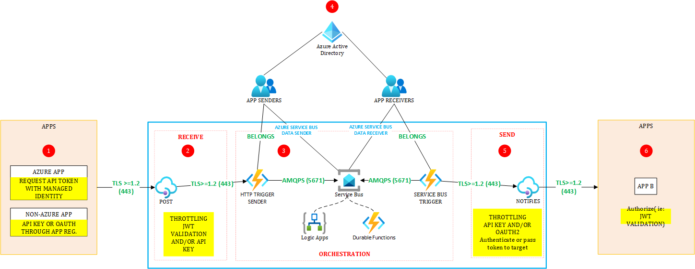

# Diagram

The purpose of such an approach is to mimic Biztalk, which was heavily used on-premises. Biztalk acted as a true integration platform to rule and handle inter-application communication in a centralized way.

# Attention Points
## (1) Sending application
The sending application calls a receiver endpoint exposed by the API layer.
## (2) Receiving API layer
This layer is managed by the integration team to ensure:

- Proper interface definitions are defined
- Standardization is enforced (security, centralized logging, etc.)
- HTTP conventions are enforced (ie: proper return codes)

The sender will queue the received message/command to a service bus belonging to the orchestration layer.

## (3) Orchestration layer
The orchestration layer handles the business logic using either Logic Apps, either Durable Functions, either a combination of both since they are not mutually exclusive. A few factors will influence the choice of the orchestration technology. Communication across steps happens asynchronously using the service bus as the message broker.

## (4) Sharing (or not) a Service Bus namespace
Considering that an integration team manages integration between applications, we can go for a single Premium Service Bus namespace, which can be isolated from internet. However, sharing a single namespace is rather challenging because there is no workspace-level RBAC. Applications have either namespace-level RBAC, which gives them access to **all** entities, either entity-level RBAC. The least privilege principle commands to only grant entity-level access. Note that this can become challenging at scale as the total number of role assignments might grow fast and could become an impediment. 

## (5) Notifying the target application
Once the initial message/command was handled by the orchestration, the outcome can be sent to the target application, yet through API Management. 

## (6) Target application
The target appliation still validates that the received message is sent by an authorized party. You can restrict by letting APIM authenticate against the app using its managed identity. Note that more than one tokens can be added to the request payload.

# Pros & Cons of using a Biztalk-like approach using IPaaS 

## Pros
- Enforce standards (interfaces, conventions, security, etc.) for integrations between applications
- Higher quality
- Centralized logging 
- Better oversight
- Higher control (no point-to-point everywhere)

## Cons
- Hard to distribute work across teams
- Can become a bottleneck at scale
- Less autonomy for teams

# Real-world observation
This type of integration requires a central integration team, which conflicts with today's distributed and microservice-based applications, for which autonomy is key. This can however be suitable for highly regulated industries.