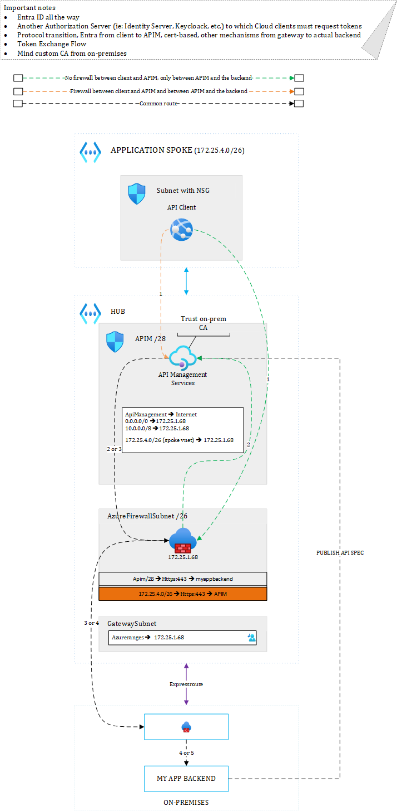
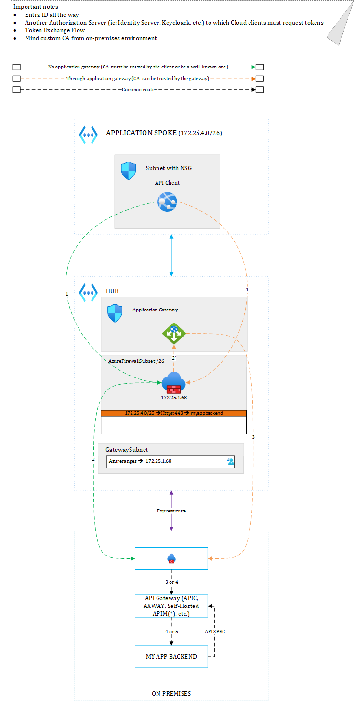

# APIM Hotrod Show
Hey folks, we're discussing many API Management-related topics on our Youtube channel, so feel free to watch and subsribe.

# API Management hybrid setup Cloud to on-premises - Introduction
In some scenarios, you must consume on-premises services through API integration. There are multiple ways to achieve this.
# Hub & Spoke topology

## On-premises APIs proxied by Azure API Management in the Hub
Note that I covered different sceanrios about where to deploy your API Management instance in [this page](hybrid.md). All these options also apply here but in this page, I prefer to focus on the fact that you use APIM as a proxy.  

There are two routes here, the green and red one. Both are valid, depending on your security requirements. 
- The green route: Cloud hosted client ==> Azure Firewall ==> API Management ==> Azure Firewall ==> Virtual Network Gateway ==> On-premises

- The red route: Cloud hosted client ==> API Management (through VNET peering) ==> Azure Firewall ==> Backend (from a spoke)

The green route involves the firewall twice while the red one only involves it once. This lets you control that the spoke can talk to APIM and that APIM can talk to the intended apim-proxy backend. On the other hand, because spoke are peered to the hub, they can technically directly connect to APIM by taking advantage of Virtual Network Peering. In any case, you must send APIM back to the firewall (except for ApiManagement tag) to control policies such as the *Send-Request* that might directly go to Internet. 

## Backend APIs proxied by an on-premises gateway
Many organizations already have an existing API gateway in front of their backend systems.

Here again, you have two routes:

- The red route: Cloud-hosted client ==> Azure Firewall ==> Virtual Network Gateway ==> on-premises firewall ==> on-premises API gateway ==> Backend

- The green route: Cloud-hosted client ==> Azure Firewall ==> Application Gateway ==> Virtual Network Gateway ==> on-premises firewall ==> on-premises API gateway ==> Backend

A third route is possible if you consider sending Application Gateway back to Azure Firewall. 

The role of Application Gateway consists in proxying the on-prem API gateway in order to trust the custom on-premises CA at the level of the gateway itself to make Cloud clients immune from custom CAs. In case you do not use Application Gateway, you have to trust the CA at the level of the client itself but not all Azure services support the injection of a custom CA.

# Conclusion

The most challenging part in such a scenario are:

- Custom certificate authorities used on-premises that must be trusted by the Cloud environment
- API Authorization, which can be particularly challenging when pushing end user identities within access tokens back to on-premises backends.