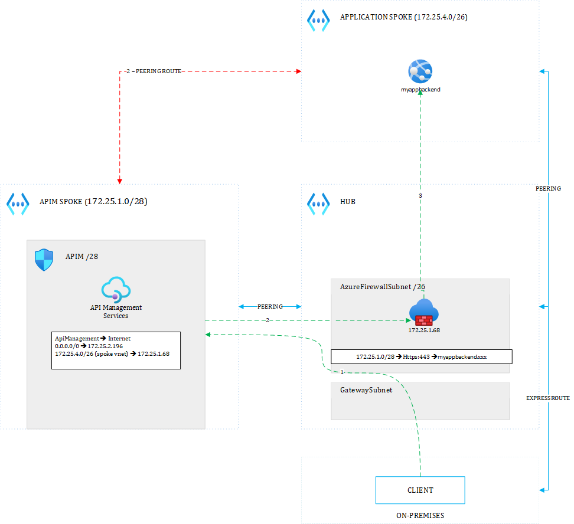
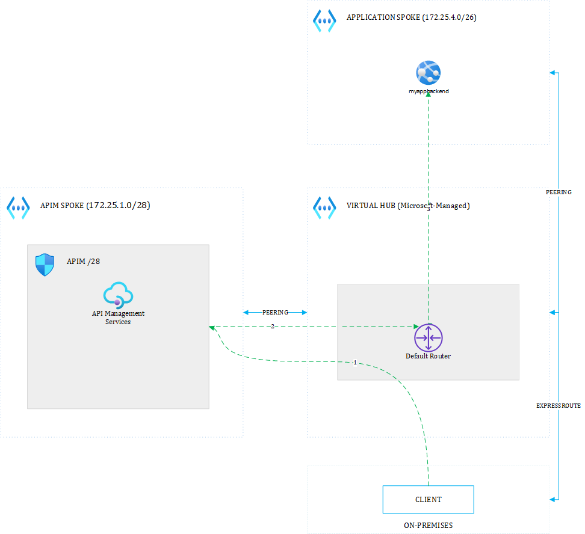
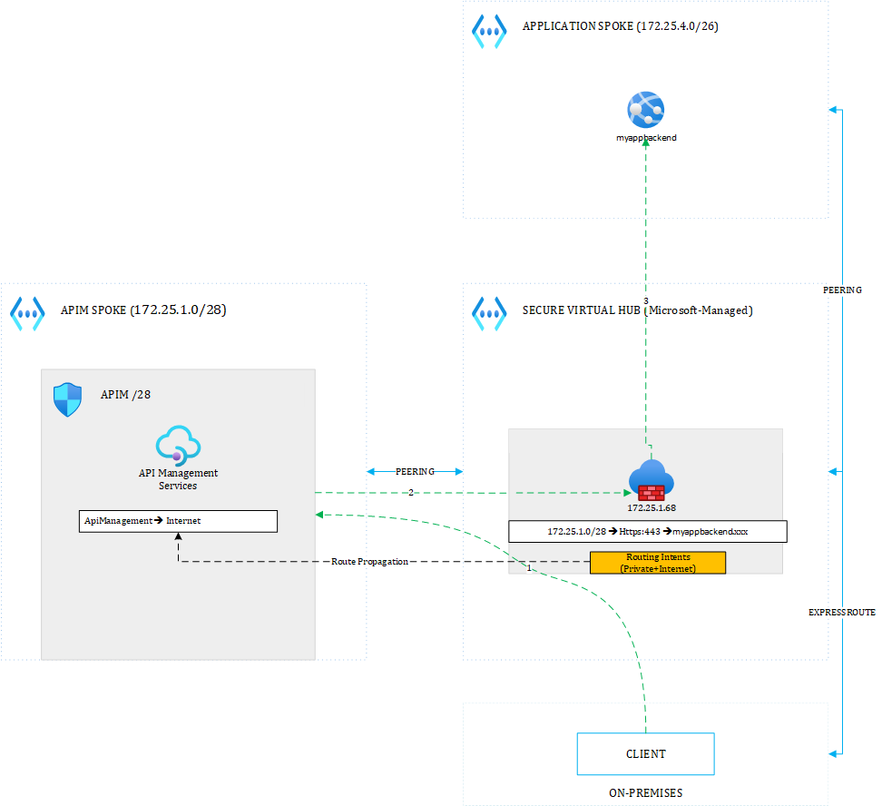

# APIM Hotrod Show
Hey folks, we're discussing many API Management-related topics on our Youtube channel, so feel free to watch and subsribe.

# API Management hybrid setup on-premises to Cloud - Introduction
Hybrid applications have some components in the Cloud and some others on-premises. This often requires you to expose Cloud-hosted APIs to on-premises clients and vice versa. The below sections help you identify different possibilities and choose the appropriate topology wisely. In terms of scenarios, I only consider a shared API Management instance that deals with multiple application spokes, in order to optimize costs. I also only consider on-premises clients talking to the Cloud, not the other way around but this will be covered in a dedicated page.

# Hub & Spoke topology

## API Management in the Hub

In any Hub & Spoke topology, you will at least have one hub that bridges the on-premises environment and the Cloud. Some organizations work with multiple hubs that deal with specific network duties, on top of segregating production and non-production environments. For sake of simplicity, let us consider a single hub as illustrated in the above diagram. 

Whether to put API Management in the hub or not is more a question of philosophy than a technical matter. Some people don't want to put anything else but an NVA, while I am rather advocating to equip the hub with whatever is required to let it perform its function. You should of course isolate the API Management into its own resource group to avoid mixing RBAC-related matters with other components of the hub.

A specific subnet /28 (could be another size) is added to the Hub. From there on, you typically have two routes when an on-premises client calls one of the hosted APIs:

- The red route: on-premises client ==> Virtual Network Gateway ==> Azure Firewall ==> API Management ==> Backend (from a spoke)
- The green route: on-premises client ==> Virtual Network Gateway ==> Azure Firewall ==> API Management ==> Azure Firewall ==> Backend (from a spoke)

The green route involves the firewall twice. The first time because, a common practice consists in making sure the GatewaySubnet routes everything to the firewall, no matter whether dealing with API traffic or not. The second hop to the firewall is optional. Indeed, since APIM is in the hub, it can already leverage Virtual Network Peering routes to connect to every spoke by default (red line). However, although this might seem overkill, the second roundtrip to the firewall (green line) let you control network traffic initiated by APIM policies such as the *Send-Request* policy. In any case, you should always make sure **NOT** to route traffic destined to the ApiManagement service tag to the firewall as this would break APIM. 

## API Management in a separate spoke
In case you decide to isolate the shared APIM into its own spoke, this would look like this:

Here again, you have two possible routes:

- The red route: on-premises client ==> Virtual Network Gateway ==> Azure Firewall ==> API Management ==> Backend (from a spoke). 

- The green route: on-premises client ==> Virtual Network Gateway ==> Azure Firewall ==> API Management ==> Azure Firewall ==> Backend (from a spoke)

The only way to bypass the firewall in this setup, is to peer the APIM spoke with the target backend spoke and remove the custom routes sending traffic to the firewall. It would however mean that the APIM spoke is a hub instead of a spoke. In the hub and spoke topology, you typically avoid peering spokes together. Spokes shoud only be peered to hubs.

# Azure Virtual WAN

## Relying only on the default router
When using Virtual WAN, it is not possible to setup anything in the Hub because Virtual Hubs are fully managed by Microsoft. Therefore, APIM must be hosted outside of the hub:

Every Virtual Hub has a default router, which allows any-to-any connectivity between all the spokes that have joined VWAN. In the above setup, APIM would automatically be able to connect to the target application spoke without any custom routing defined. Nevertheless, many companies rather use Secure Virtual Hubs insted of Virtual Hubs and this is the architecture shown in the next section.

## Relying on the Secure Hub's appliance 

In this setup, a Firewall Policy is assigned to the Virtual Hub, making it become a Secure Virtual Hub.

There are multiple ways to enforce a specific routing behaviour in VWAN but one of the easiest is called *Routing Intents*, which allows you to send all traffic (private and/or internet) to an appliance of your choice. For the time being, APIM premium still requires to bypass the firewall for the APIManagement Service Tag. That is why you still need a custom route table on the APIM subnet. 

# Using workspaces or not
Workspaces are the building block allowing you to share a single API Management instance across multiple project teams where each team can be isolated into its own workspace, from a compute and an RBAC perspective. Each workspace may have its own gateway or you can share a single gateway across multiple projects (cost friendly). You would choose either of these options according to non-functional requirements and available budgtet.

It is however important to consider the current limitations of workspaces today documented in the *Gateway Constraints* section of this document https://learn.microsoft.com/en-us/azure/api-management/workspaces-overview

These are still rather important limitations.