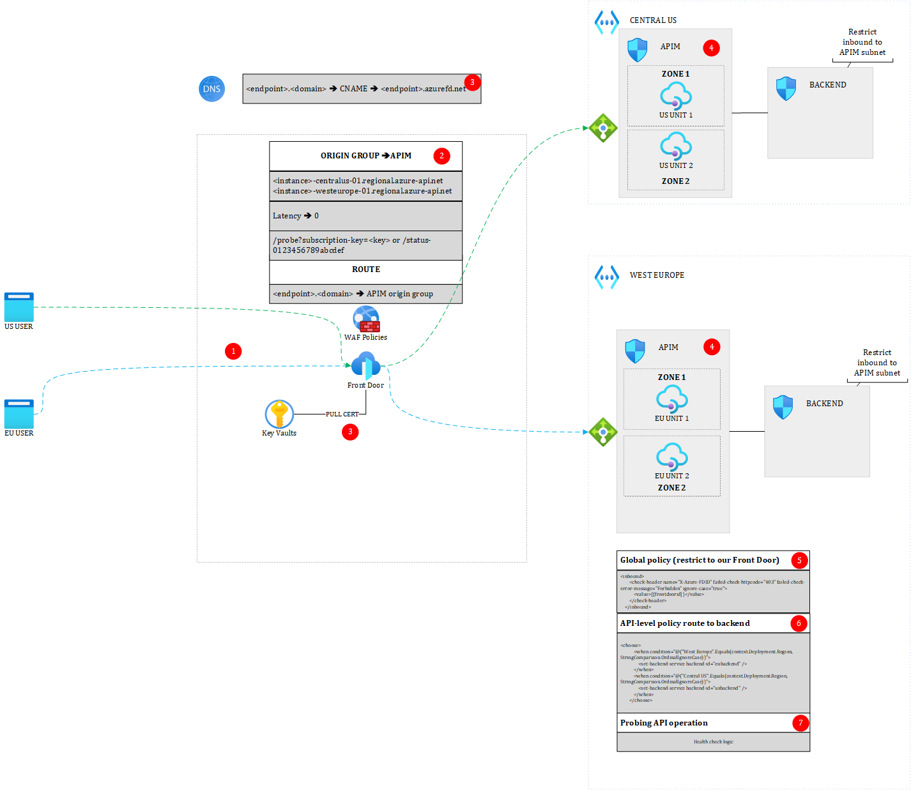

# Diagram

# Attention Points
## (1) User traffic routing 
In this setup, the load balancing algorithm is latency-based (latency=0 in the Origin Group). This means that theoritically, the user will be sent to the closest backend. Note that this is by no means a certainty, so a US user could be sent to Europe and vice-versa.

## (2) Origin Group
### Load balancing
In this setup, Front Door is in the driving seat because I have used regional gateway units as part of the origin group. This means that the load balancing algorithm between gateway units can be changed at anytime, by adjusting priorities, weight, etc.
One downside of this approach is that you'll have to update the origin group if you add a new unit in a new region. 
### Probing
To probe your backend APIs, you can either use APIM's default health check endpoint */status0123456789abcdef*, either use a custom endpoint. I typically prefer the latter because APIM's health does not reflect the health of your backend services. In case you create a custom endpoint, go to item number 7 below. 

### Custom Domains
While you will typically work with a custom front end domain, you can afford to work with APIM's default domain if you plan to use Front Door as the single entry point. In this case, the APIM default domain is shielded off by Front Door. If you still want to go for your own domain and own certificate for APIM, beware that in 12/23, Front Door does not support custom Certificate Authorities for TLS to the origin.

## (3) Bring your own certificate with Key Vault and a custom DNS domain.
At the time of writing (12/23), Key Vault must be internet facing to let Front Door pull the certificate. You can use Front Door's system identity to pull the certificate. The RBAC role *Key Vault Secrets User* must be granted to the identity. Make sure to use Azure RBAC with Key Vault instead of legacy *Access Policies*. For you custom doamin, you must create a CNAME record in your public DNS that points to the endpoint you defined in Front Door.

## (4) API Management (APIM) gateway units and management plane.
### Internet facing APIM
In this setup, the primary region for APIM is is West Europe. At the time of writing (12/23), APIM must be internet facing because Front Door is unable to see APIM's internal load balancer when used in VNET internal mode. Private Link Service is not an option either for the time being. 
Therefore, in this setup, APIM integrates with a virtual network in External mode. Each gateway unit sits in its corresponding regional virtual network. The subnets in which gateway units are deployed are protected by their respective network security group. 
Traffic can be restricted to [APIM's control plane requirements] (https://learn.microsoft.com/en-us/azure/api-management/api-management-using-with-vnet?tabs=stv2) as well as to the *Front Door Backend Service Tag*. Note that this does not restrict traffic to *your* Front Door instance, but to the Front Door service at large. This already helps block bot calls and the likes. In 12/23, the only way to keep APIM fully private is to put an Application Gateway between Front Door and APIM. However, you'd need one Application Gateway per region, which increases costs and introduces a performance penalty incured by the extra hop. The reason why it is still preferred to work with APIM External mode than a non-VNET-integrated APIM is to make sure APIM's outbound traffic can access upstream private backends. While this can also be achieved with Standard V2, multi-region is only available in the Premium tier.
### Management plane
Should the primary region become unavailable, the other gateway units can still function. It will however not be possible to change anything in the APIM config until the primary region comes back.
### High-Availability
While multi-region Gateways offer high availability by default, you can still increase the level of availability in each region by enabling zone redundancy.

## (5) Global Policy
To restrict traffic to your own Front Door instance, you must write a policy that checks the presence of the HTTP request header named *X-Azure-FDID*. This header is written by Front Door and contains the unique identifier of your Front Door instance. 
This global policy makes sure all calls have to go to Front Door before hitting APIM. If you would still like to tap into specific products/APIs, you might either define this policy at another scope, either break inheritance at a lower scope. 
You should store Front Door's unique ID in a named value.

## (6) API-level Policy
When Azure API Management is used in a multi-region setup, you cannot specify the backend service in the API settings, because you do not know in advance which regional gateway unit will be chosen. You must write a *set-backend-service* policy to route traffic dynamically according to the chosen gateway unit. The logic is rather simple: if the EU Gateway is chosen, you route to the EU backend, else to the other regional backend. You can add extra resilience logic to still fallback on the other region should the default backend not be available. This heavily depends on your probing logic defined at the level of Front Door. 

## (7) Health probe endpoint
If you prefer not to rely on APIM's default health check endpoint, make sure to have an API operation that you can call using a subscription key. You cannot have an OAUTH2-protected endpoint because Front Door simply performs GET or HEAD requests against the endpoint. Using a key is a convenient way to protect the probing endpoint. Depending on the number of APIs you have, you might write a logic that reflects the true health of your backends. Whatever you do, always make sure to support the HEAD verb to reduce bandwidth (and extra costs). If you want an endpoint that returns more info about the health of your system, make sure to craft it separetely and not use it as a target of the Front Door probe. The reason is that Front Door makes a lot of requests against the probe endpoint and this can result in high bandwith usage, as well as high compute depending on what you're doing to determine the health of your system.
