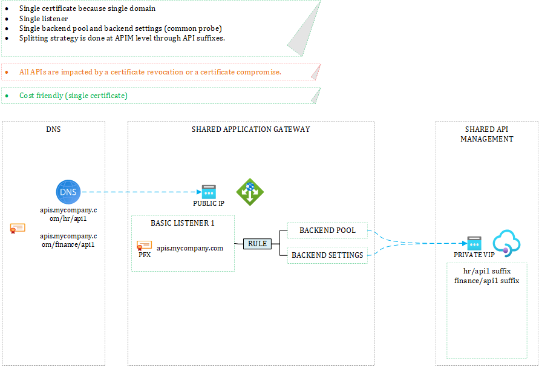
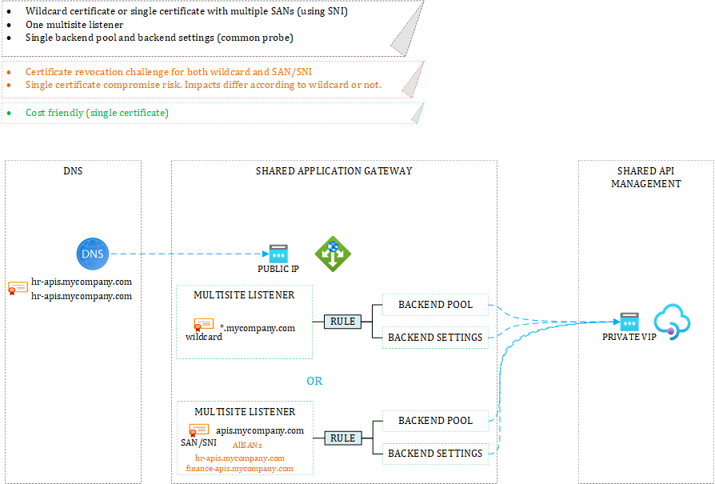

# APIM Hotrod Show
Hey folks, we're discussing many API Management-related topics on our Youtube channel, so feel free to watch and subsribe.

# Exposing a shared API gateway - Domain Strategies - Introduction
API Management comes at a certain cost in Azure, especially the Premium pricing tier. Therefore, many companies tend to consolidate multiple APIs from different business lines onto the same instance. This page shows how to expose them to Internet consumers. 

# Topologies
It is assumed that the API gateway itself is private (not internet facing) and proxies by WAF-enabled Azure Application Gateway or Front Door. The below topologies consider Application Gateway but principles remain the same with Front Door.

## Single domain
You may decide that all your APIs are exposed through a single domains such as *apis.mycompany.com*. The below topology illustrates this setup:

## Business-specific domains with basic listeners

An alternative to option 1 is to have one domain per business line. Granularity can be more fine-grained as well. It is up to you to decide how you want to split your APIs. 

Since each domain has its own certificate, a breach will not lead to a breach for all your APIs but only the ones from the affected domain. Certificate revocation is also made easier and blast radius is minimized. On the flip side, you must make sure to have an efficient PKI and be willing to pay for all the certificates.

## Business-specific domains with multisite listeners
Application Gateway ships with multisite listeners, which allow you to expose multiple domains onto the same listener. 

You can either use wildcard certificates (unlikely in security-driven organizations) or leverage Server Name Indication (SNI) that lets you use a single certificate for different hostnames (FDQNs). In both cases, you would use a single certificate. The blast radius is case the certificate is compromised varies since wildcard certs let you create **any** sub-domain of *mycompany.com*, while SNI remains restricted to the hostnames specific in the certificate itself.