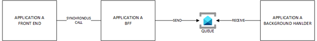

# Load Levelling Diagram

This pattern is a design pattern that's used to even out the processing load on a system. It helps manage and reduce the pressure on resources that are invoked by a high number of concurrent requests.

In such a scenario, you typically let the BFF (Backend for Frontend) queue commands to a service bus queue (or any other broker). Background handlers do process the commands at their own pace. Note that backend handlers will be in a *Competing Consumer* situation (fist come first served).

# Pros & Cons of Load Levelling

## Pros

- Frontend is not slown down upon high-load
- The overall system is more scalable
- The different parts of the system can easily be scaled up/out differently

## Cons
No real cons about using this pattern but it brings a little more complexity than a synchronous approach because end users often like to get an immediate feedback about their actions. Here are a few options to deal with the asynchronous nature of the flow:

- The backend sends a 202 (Accepted) with a link to poll for the status. In the meantime, the frontend shows a message like "command is being executed, refresh the page or come back later.". This is not the most user-friendly approach.
- Both frontends and backends exchange information through *Azure SignalR Service* to have *near real time* status about the ongoing command. This is more complex, hence the cons.

- Depending on the frontend (ie: mobile app), the backend can send a notification (ie: Push Notification) to the client device once the job is done!

# Topics discussed in this section

| Diagram | Description |Link
| ----------- | ----------- | ----------- |
| Point-to-point (P2P) pattern | Explanation of P2P with benefits and drawbacks|[P2P-pattern](point-to-point.md) |
| Load Levelling pattern | Explanation of Load Levelling, which is some sort of P2P within a single application|[load-levelling-pattern](load-levelling.md) |
| PUB/SUB pattern with Event Grid PUSH/PUSH| Explanation of PUB/SUB pattern with benefits and drawbacks when using Event Grid in PUSH/PUSH mode|[event-grid-push-push](pub-sub-event-grid.md) |
| PUB/SUB pattern with Event Grid PUSH/PULL| Explanation of PUB/SUB pattern with benefits and drawbacks when using Event Grid in PUSH/PULL mode|[event-grid-push-pull](pub-sub-event-grid-pull.md) |
| PUB/SUB pattern with Service Bus PUSH/PULL| Explanation of PUB/SUB pattern with benefits and drawbacks when using Service Bus in PUSH/PULL mode|[service-bus-push-pull](pub-sub-servicebus.md) |
| PUB/SUB pattern in PUSH/PUSH/PULL with two variants| Explanation of  a less common pattern based on PUSH/PUSH/PULL.|[pub-sub-push-push-pull](pub-sub-push-push-pull.md) |
| API Management topologies | This diagram illustrates the internet exposure of Azure API Management according to its pricing tier and the chosen WAF technology|[apim-topologies](../../api%20management/topologies.md) |
| Multi-region API platform with Front Door in the driving seat| This diagram shows how to leverage Front Door's native load balancing algos to expose a globally available API platform|[frontdoor-apim-option1](../../api%20management/multi-region-setup/frontdoorapim1.md) |
| Multi-region API platform with APIM in the driving seat| This diagram shows how to leverage APIM's native load balancing algo to expose a globally available API platform|[frontdoor-apim-option2](../../api%20management/multi-region-setup/frontdoorapim2.md) |