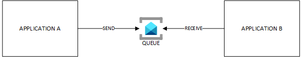

# Point-to-point (P2P) Diagram

This pattern is used when both the producer and the consumer of a message are tightly coupled. The producer is **not** agnostic from its consumer. 

# Pros & Cons of P2P

## Pros

- Easy
- Can help scale applications

## Cons

- Becomes quickly unmanageable at scale as you may lose oversight over how many P2P integrations you have within the global landscape.
- Touching a single app might break others.

# Note

You should minimize the use of P2P integration for inter-application integration. It is however a suitable for solution for intra-application traffic when components of the same application exchange information through a Service Bus or Storage Account queue (see load levelling).

# Topics discussed in this section

| Diagram | Description |Link
| ----------- | ----------- | ----------- |
| Point-to-point (P2P) pattern | Explanation of P2P with benefits and drawbacks|[P2P-pattern](./patterns/event-driven-and-messaging-architecture/point-to-point.md) |
| Load Levelling pattern | Explanation of Load Levelling, which is some sort of P2P within a single application|[load-levelling-pattern](./patterns/event-driven-and-messaging-architecture/load-levelling.md) |
| PUB/SUB pattern with Event Grid PUSH/PUSH| Explanation of PUB/SUB pattern with benefits and drawbacks when using Event Grid in PUSH/PUSH mode|[event-grid-push-push](./patterns/event-driven-and-messaging-architecture/pub-sub-event-grid.md) |
| PUB/SUB pattern with Event Grid PUSH/PULL| Explanation of PUB/SUB pattern with benefits and drawbacks when using Event Grid in PUSH/PULL mode|[event-grid-push-pull](./patterns/event-driven-and-messaging-architecture/pub-sub-event-grid-pull.md) |
| PUB/SUB pattern with Service Bus PUSH/PULL| Explanation of PUB/SUB pattern with benefits and drawbacks when using Service Bus in PUSH/PULL mode|[service-bus-push-pull](./patterns/event-driven-and-messaging-architecture/pub-sub-servicebus.md) |
| PUB/SUB pattern in PUSH/PUSH/PULL with two variants| Explanation of |[pub-sub-push-push-pull](./patterns/event-driven-and-messaging-architecture/pub-sub-push-push-pull.md) |
| API Management topologies | This diagram illustrates the internet exposure of Azure API Management according to its pricing tier and the chosen WAF technology|[apim-topologies](./api%20management/topologies.md) |
| Multi-region API platform with Front Door in the driving seat| This diagram shows how to leverage Front Door's native load balancing algos to expose a globally available API platform|[frontdoor-apim-option1](./api%20management/multi-region-setup/frontdoorapim1.md) |
| Multi-region API platform with APIM in the driving seat| This diagram shows how to leverage APIM's native load balancing algo to expose a globally available API platform|[frontdoor-apim-option2](./api%20management/multi-region-setup/frontdoorapim2.md) |