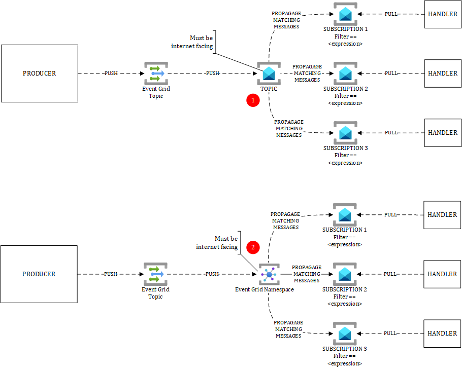

# PUB/SUB in PUSH/PUSH/PULL mode

Read the other PUB/SUB mechanisms if you want to know more about PUB/SUB.The above diagram illustrates two different approaches described below.

# Attention points
## (1) PUSH/PUSH/PULL with Event Grid and Service Bus
In this pattern, the event producer (sender) sends its events to event grid in **push** mode, which in turns **pushes** the event to its subscribers. Azure Service Bus can be a direct subscriber of an Event Grid topic. Using this pattern allows you to:

- Process events at your own pace thanks to the PULL mechanism offered by Service Bus. 
- Use advanced Service Bus features, which are not available in Event Grid
- Use the eventing services of Azure to make events transit from the external perimeter (internet) to the internal one, without exposing any custom interface to internet. 

As you noticed in the other sections, Event Grid can only notify public facing endpoints, which might force you to expose an API to internet to perform internal kitchen related things. Using Service Bus in between forces you to expose Service Bus, but you do not have to craft your own API to respond to Event Grid events. The question of using Custom Topics rather than Service Bus topics can be subject to debate. However, if you need to react to Azure and AKS system events, you'll be forced to use Event Grid System Topics, which would in this case force you to have a public facing endpoint. 

## (2) PUSH/PUSH/PULL with Event Grid and Event Grid Namespaces
This pattern is very similar to the previous one, except that you rely on Event Grid Namespaces instead of Service Bus.

# Real world observations

- The first pattern (Event Grid ==> Service Bus) is regularly used. I noticed that Service Bus is sometimes added later on because of scalability issues. As explained in the PUSH/PUSH section, handlers are not always able to follow the pace of Event Grid. In such a situation, Service Bus can be put as an intermediate layer as a buffer, and let handlers dequeue at their own pace.

- Since Event Grid Namespaces are a recent addition, I haven't seen them much used yet.

# Topics discussed in this section

| Diagram | Description |Link
| ----------- | ----------- | ----------- |
| Point-to-point (P2P) pattern | Explanation of P2P with benefits and drawbacks|[P2P-pattern](./patterns/event-driven-and-messaging-architecture/point-to-point.md) |
| Load Levelling pattern | Explanation of Load Levelling, which is some sort of P2P within a single application|[load-levelling-pattern](./patterns/event-driven-and-messaging-architecture/load-levelling.md) |
| PUB/SUB pattern with Event Grid PUSH/PUSH| Explanation of PUB/SUB pattern with benefits and drawbacks when using Event Grid in PUSH/PUSH mode|[event-grid-push-push](./patterns/event-driven-and-messaging-architecture/pub-sub-event-grid.md) |
| PUB/SUB pattern with Event Grid PUSH/PULL| Explanation of PUB/SUB pattern with benefits and drawbacks when using Event Grid in PUSH/PULL mode|[event-grid-push-pull](./patterns/event-driven-and-messaging-architecture/pub-sub-event-grid-pull.md) |
| PUB/SUB pattern with Service Bus PUSH/PULL| Explanation of PUB/SUB pattern with benefits and drawbacks when using Service Bus in PUSH/PULL mode|[service-bus-push-pull](./patterns/event-driven-and-messaging-architecture/pub-sub-servicebus.md) |
| PUB/SUB pattern in PUSH/PUSH/PULL with two variants| Explanation of |[pub-sub-push-push-pull](./patterns/event-driven-and-messaging-architecture/pub-sub-push-push-pull.md) |
| API Management topologies | This diagram illustrates the internet exposure of Azure API Management according to its pricing tier and the chosen WAF technology|[apim-topologies](./api%20management/topologies.md) |
| Multi-region API platform with Front Door in the driving seat| This diagram shows how to leverage Front Door's native load balancing algos to expose a globally available API platform|[frontdoor-apim-option1](./api%20management/multi-region-setup/frontdoorapim1.md) |
| Multi-region API platform with APIM in the driving seat| This diagram shows how to leverage APIM's native load balancing algo to expose a globally available API platform|[frontdoor-apim-option2](./api%20management/multi-region-setup/frontdoorapim2.md) |