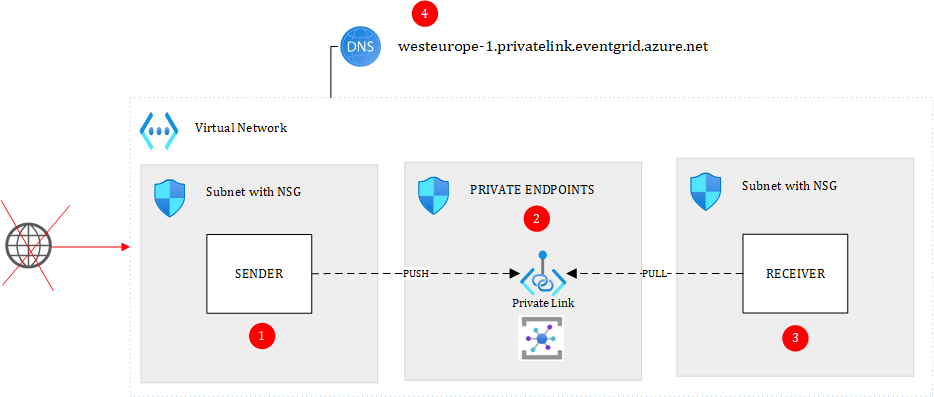

# PUB/SUB with Azure Event Grid in PUSH/PULL Mode

The PUB/SUB pattern is popular in Event-Driven Architectures and Microservices. The producer of a message is agnostic of its subscriber(s). Each subscriber receives a copy of the original message sent by the topic. The above diagram and below attention points are applicable only to Event Grid in PUSH/PULL mode. To be clear, PUSH/PULL means that the sender **pushes** the event while the receiver **receives** it through a **pull** mechanism. In other words, the receiver polls Event Grid to check if new events were queued to the subscription. The main benefit of a PUSH/PULL approach with Event Grid is that you can isolate everything from internet at no extra cost.

# Attention points
## (1) Sender and receiver in a private context
Sender and receiver must have access to the private namespace from a connectivity and DNS resolution aspect.

## (2) Event Grid Namespace
In order to do PUSH/PULL with Event Grid, you must use the **Event Grid Namespace** service. You can fully privatize the namespace by denying public traffic and adding one or more private endpoints to it. 

## (3) Pull-based with Event Grid
When using the pull-based model, handlers can dequeue events at their own pace. The center of gravity of your architecture is the Event Grid Namespace itself, as you should foresee its capacity to play a buffer role in case your handlers are down.

## (4) Private link for Event Grid Namespaces
You can enable private link for your Event Grid Namespace and deny public traffic. Note that the private DNS that must be created should be <region>-1.privatelink.eventgrid.azure.net (the portal currently doesn't create the correct zone). The private IP corresponding to your namespace must be added to that zone and the zone must be linked to the virtual network(s) where resolution is required.

# Pros & Cons of Pub/Sub using Event Grid Namespaces

## Pros

- Producers and subscribers are more decoupled
- You can isolate the namespace from Internet at no extra cost, unlike with Azure Service Bus for which, a premium tier is required (about 600€/month).
- Subscribers can apply their own filters to only subscribe to what they are interested in.

## Cons

- At this stage (12/23), it lacks integration with other Azure Services.
- Lacks features that Service Bus has (ie: sessions)

# Real world observations

- Since Event Grid Namespaces are still 