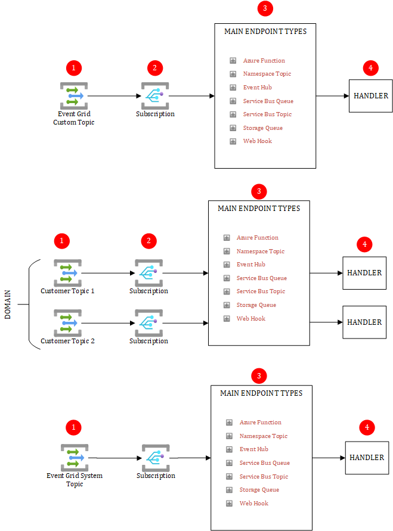

# PUB/SUB with Azure Event Grid in PUSH/PUSH Mode

The PUB/SUB pattern is popular in Event-Driven Architectures and Microservices. The producer of a message is agnostic of its subscriber(s). Each subscriber receives a copy of the original message sent by the topic. The above diagram and below attention points are applicable only to Event Grid in PUSH/PUSH mode. To be clear, PUSH/PUSH means that the sender **pushes** the event while the receiver is **notified** through a **push** mechanism. In other words, Event Grid initiates the call to notify the receiving party.

# Attention points
## (1) Topic type
Event Grid gives us the possibility to work with:

- Custom Topics to send our discrete events. These topics can be regrouped into a given domain
- System Topics to capture Azure events

## (2) Filters
Make sure to version your messages sent to the topic and to include the version into the subscription filters (along with other filter criteria). This helps maintain backward compatibility and allows you to change the structure of a message (including breaking changes) without harming the current subscribers of a given version. You may rollout a new "release" gradually and support side-by-side multiple versions of a given message.

## (3) Push-based with Event Grid
When using the push-based model, notified endpoints must be internet facing. This is a strong show stopper in the Hub & Spoke model. Event Grid can be bound to many different endpoint types. 

## (4) Handlers can become a potential bottleneck
Event Grid can take many events per second and will notify the subscribers right away. Make sure that your handlers are able to follow the pace in case of high load. To illustrate this further, you must make sure to choose an appropriate hosting option for your handlers. For example, while Azure Functions Elastic Premium is a very good fit, Azure Functions running on an External App Service Environmment might be a bottleneck, given the time taken by an ASE to scale out. The center of gravity of your architecture is the handling part.

# Pros & Cons of Pub/Sub using Azure Service Bus

## Pros

- Producers and subscribers are more decoupled
- Subscribers can apply their own filters to only subscribe to what they are interested in.

## Cons

- Higher costs if you isolate Azure Service Bus from Internet
- Can lead to some troubleshooting and debugging complexity when PUB/SUB is used in a chain of events (ie: topic 1 ==> subscriber 1 ==> new topic ==> new subscriber)

# Real world observations

- Custom topics are often used for discrete events
- System topics remain the only way to react to Azure changes. They are heavily used by infrastructure automation and monitoring systems.