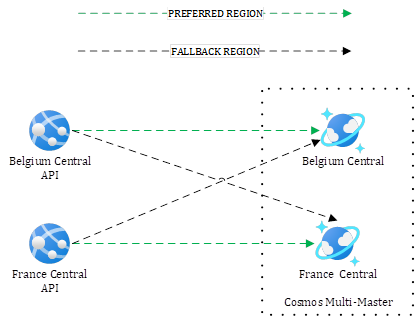
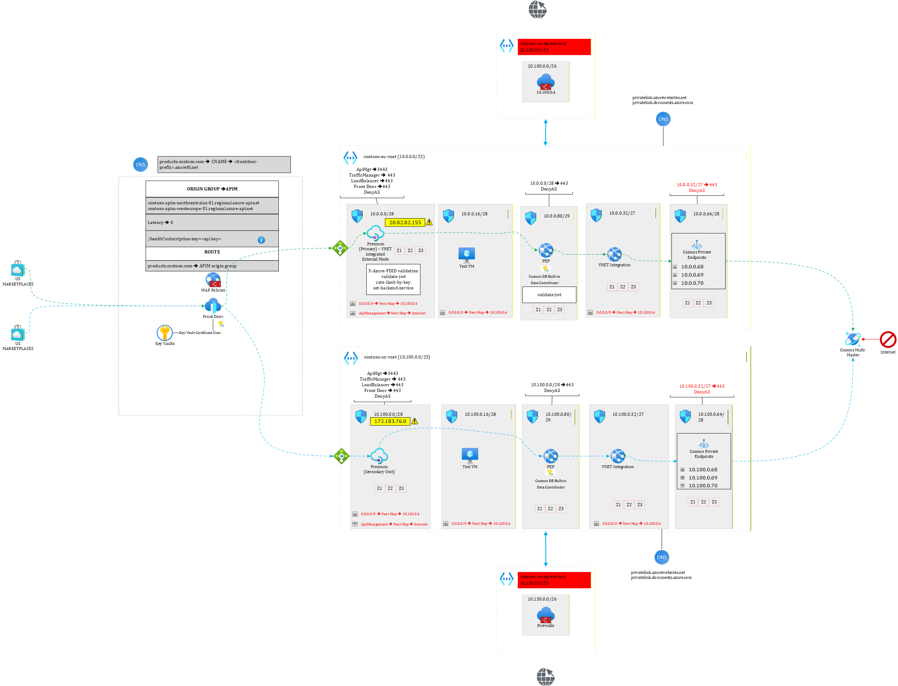
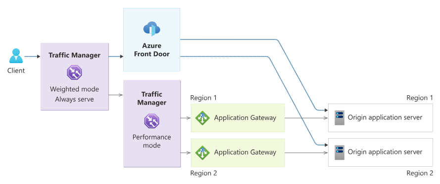

# Disaster recovery with Cosmos DB - focusing only on RTO not RPO
The purpose of this section is to highlight how to minimize downtime using Cosmos DB. You can deploy the provided example ([terraform](./terraform/) and [sample console app](./application%20code/)) that makes use of a multi-region writes Cosmos and two app services spread across two regions. The sample application is an API that leverages the Cosmos DB SDK and seamlessly finds the available Cosmos region. Once deployed, you can try different things out such as removing one of the Cosmos regions, setting a writable region to read-only or even taken an entire region offline. The APIs in both regions will still be working fine for both reads and writes. I developed the API in such a way that it includes the regional Cosmos backend that it talked to into the response. This lets you analyze the behavior under normal circumstances as well as when facing adverse events. The end result looks like this:

# Multi-region writes

This diagram shows an end-to-end architecture where the entry point is Front Door. Next, a premium APIM instances with different regional gateway units forwarding traffic to their regional backends. Front Door decides where to send traffic (geo-proximity by default) and when implementing smart health checks, it should always be aware of the backend health. Next we have our regional backends talking by default to their corresponding regional Cosmos instance. 

Note: I delivered a 25-minute live demo of the above setup during a Microsoft API Management event (https://www.youtube.com/watch?v=dbwvhGVV3mU starting at minute 53 of the recording). Microsoft slightly fast-forwarded the video, so the pace is a bit quicker, but it remains possible to follow if you stay focused 😊.

With the recent events affecting Azure Front Door, an even more robust approach consists in adding Traffic Manager to the mix. Microsoft documented this here https://learn.microsoft.com/en-us/azure/architecture/guide/networking/global-web-applications/mission-critical-global-http-ingress. Here is MS diagram extracted from the online doc:

In a nutshell, Traffic Manager sends traffic to Front Door but should Front Door be unhealty, the fallback path is to use an intermediate Traffic Manager, which, in turn, forwards to the closest Application Gateway.