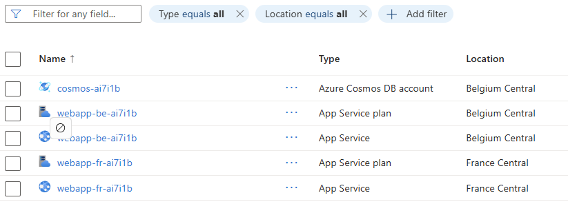
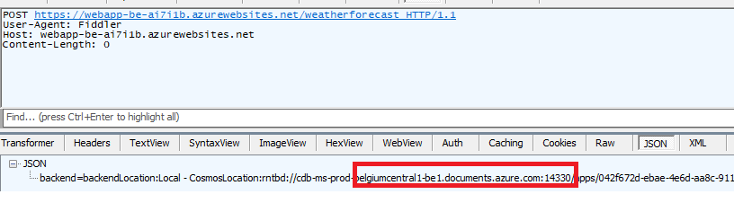
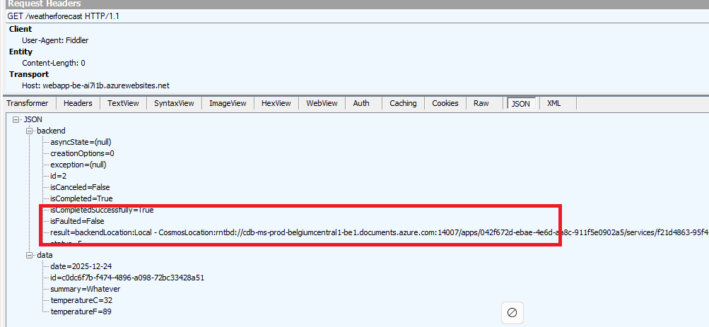

# Availabilty Samples

This sample code deploys:

- Two webapps, one in Belgium Central and one in France Central
- One Cosmos DB account with multi-region writes  
- It pushes the application code (zip file) to both web apps

To run this:

- Clone this on your machine or Open an Azure Cloud Shell and clone it from there
- make sure to cd into the current folder
- run: terraform init
- run: terraform apply --auto-approve

Once deployed, you should end up with the following resources:

To test the API, you can use postman or fiddler by first performing a POST request, to create a document:

The API operation will create a document and return which regional Cosmos DB region was used.

Same for a GET request:

Now, you can start playing with Cosmos to see how the API react. Here are the following things you can test:

- Marking one of the regions read only. In such a case, both APIs (Belgium and France) should automatically go to the remaining writable region, but reads (GET queries) would still pick their regional instance.
- Deleting one of the regions. In such a case, both APIs should automatically go to the remaining region for both reads and writes
- Offline a region. In such a case, an automatic failover should take place to the remaining region. Note that you must create a support ticket to get it back online. Just try this one after having tried the other changes.