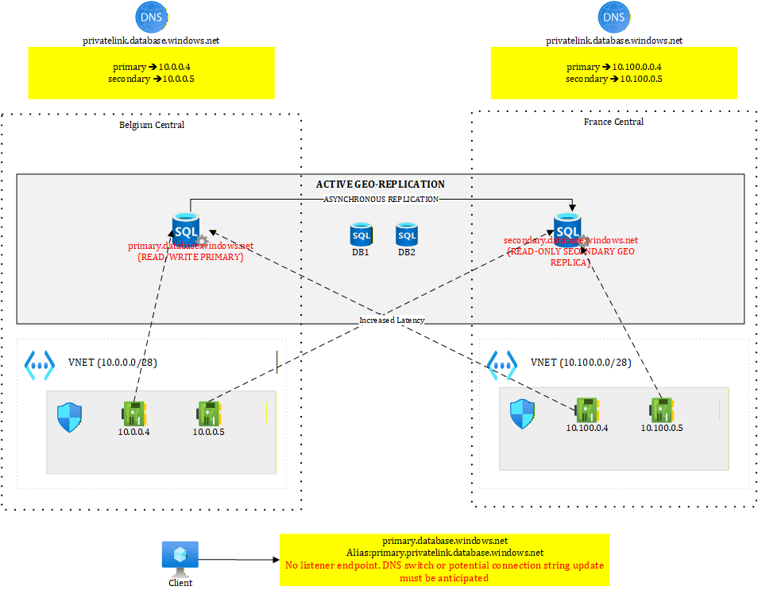
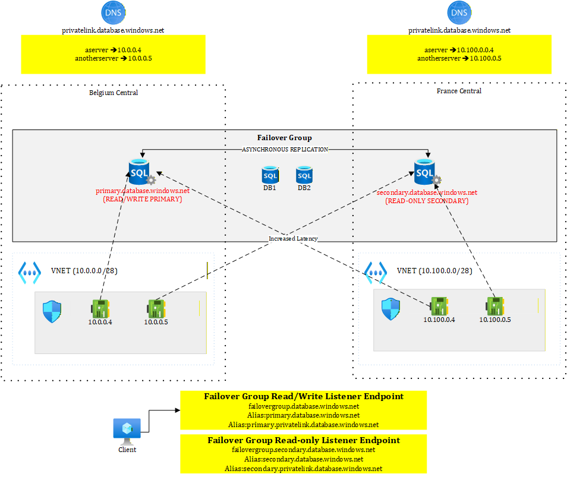
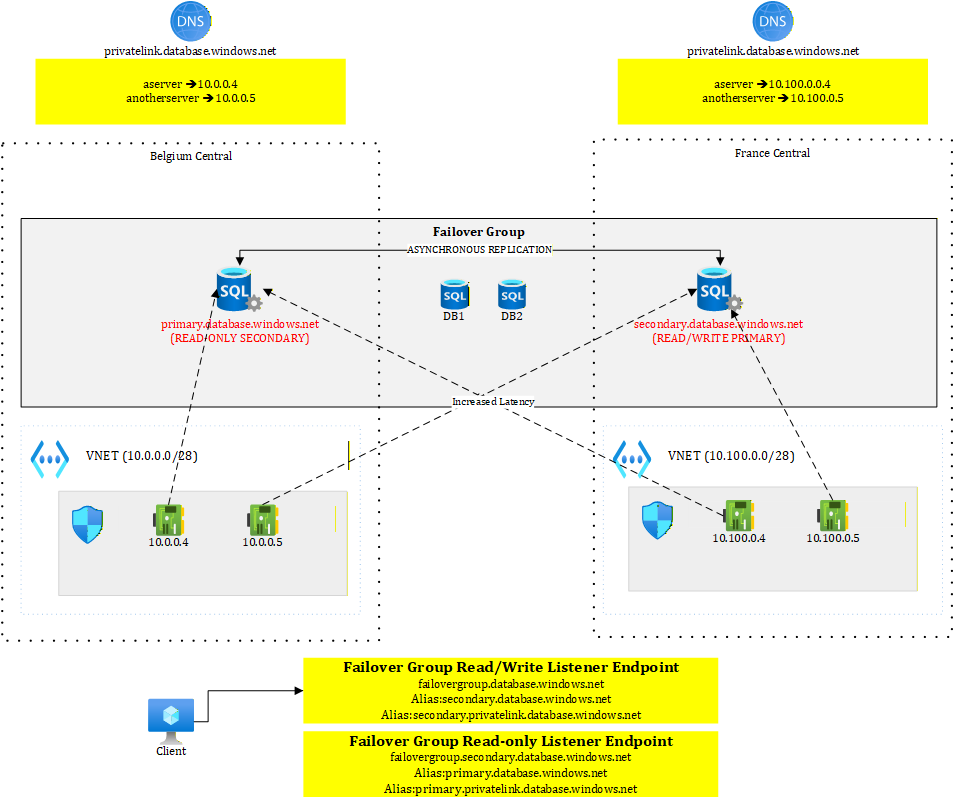

# Disaster recovery with Azure SQL - focusing only on RTO not RPO
The purpose of this section is to highlight how to minimize downtime using Azure SQL. You can deploy the provided example ([terraform](./terraform/) and [sample console app](./application%20code/)) that makes use of failover groups and a sample demo console application to test it. 

# Active geo replication

This diagram highlights how databases get replicated in the secondary region and the private endpoints that must be deployed on each site for full read/write and read-only access. This setup assumes that you have transactional components targeting the read-write DB, as well as less critical components such as reporting etc. that talk to the read-only database. In case of failover, all components would still be able to target both the new primary and the new secondary (when the initial primary region is back).

# Failover Groups

This diagram shows the situation before failover. We see that the read-write and read-only listeners target respectively the primary (read-write) and secondary (read-only) servers, using DNS aliases. 

In case of failover, the DNS gets updated automatically. 

This behavior allows for zero configuration impact on the client side. Note that during failover, running workloads may still encounter some exceptions but the friction is minimal. Feel free to test the provided code to see it live.

# Attention Points

- Geo replication allows you to configure per-database geo replicas while failover groups regroup one or more databases that failover together
- Geo replication failover is manual while failover group support both manual and automatic modes
- Geo replication doesn't abstract the primary and secondary servers while failover groups provide listener endpoints that always target primary and secondary servers. In case of failover, the clients do not need to be failover-aware nor to update connection strings.