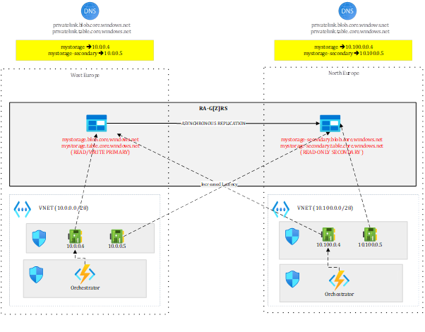
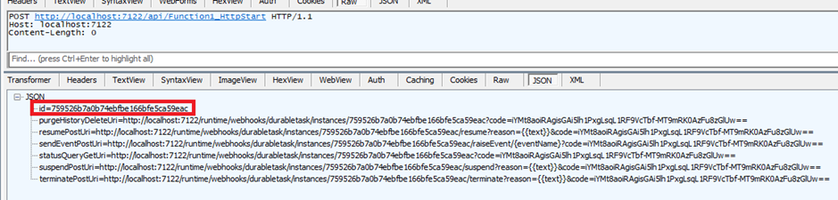
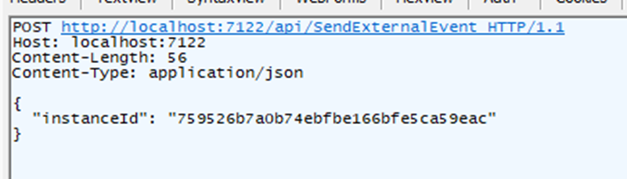
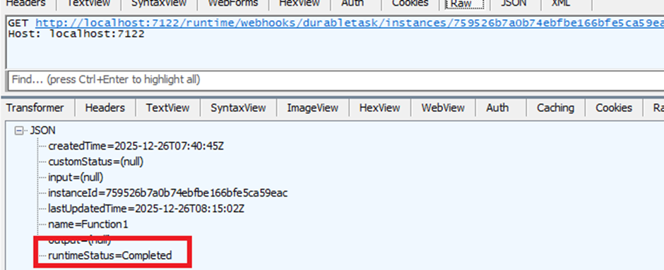

# Simple Durable Function
An enterprise-grade version of this application would look like this diagram.

Where your orchestrator, hosted on an App Service levering VNET integration is getting access to the Storage Account through 10.0.0.4 to persist state. The North Europe version of the orchestrator could already be deployed but stopped to avoid possible interferences. 
In case of regional outage or DR test, you failover the Storage Account and once the failover completed, you start the orchestrator in North Europe that now points to the new primary. Durable functions make mostly use of Queues and Tables to work and persist state. Once the failover completed, you should be able to resume ongoing orchestrations. However, since the replication process is asynchronous, you may lose some of them.
To help you test this scenario, I have crafted a very little Durable Function that is just waiting for an external event:

`public static async Task RunOrchestrator(
    [OrchestrationTrigger] TaskOrchestrationContext context)
{
    ILogger logger = context.CreateReplaySafeLogger(nameof(Function1));
    logger.LogInformation("Waiting for external event");      
    var eventData=await context.WaitForExternalEvent<DateTime>("event");
    logger.LogInformation("external event received {0}", eventData.ToString());        
}`
The orchestration is started by this HTTP triggered function:
`public static async Task<HttpResponseData> HttpStart(
    [HttpTrigger(AuthorizationLevel.Anonymous, "get", "post")] HttpRequestData req,
    [DurableClient] DurableTaskClient client,
    FunctionContext executionContext)
{
    ILogger logger = executionContext.GetLogger("Function1_HttpStart");

    // Function input comes from the request content.
    string instanceId = await client.ScheduleNewOrchestrationInstanceAsync(
        nameof(Function1));

    logger.LogInformation("Started orchestration with ID = '{instanceId}'.", instanceId);
        
    return await client.CreateCheckStatusResponseAsync(req, instanceId);
}`

The idea is to start a new orchestration by calling the HTTP triggered function:
 
And get the instance ID of the orchestration for later use.
After this, you can initiate the failover. Once completed, you should raise the external event and see if the orchestrator is able to resume this orchestration:

 

If everything works fine. The orchestration status should show as completed:

 

You can test this easily locally by making sure to:

-	Use a GRS/GZRS/RA-GRS/RA-GZRS Storage Account 
-	Bind your local solution to the Storage Account by assigning the connection string of your Storage Account to the AzureWebJobsStorage setting in local.settings.json

Of course, in this case, you use public DNS and an Internet facing Function App, which is way simpler than the enterprise-grade design I depicted earlier. This is however enough to experiment with a concrete use case. So, you go ahead and download the code for local testing.

