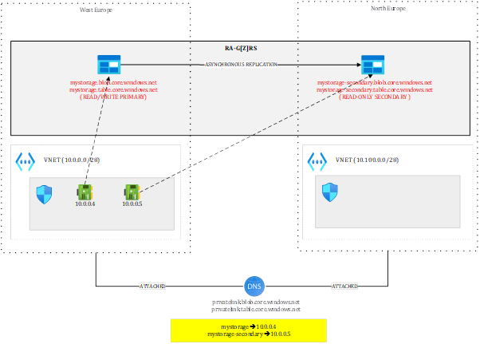
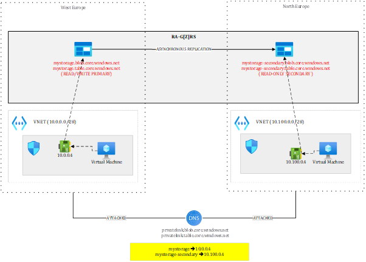
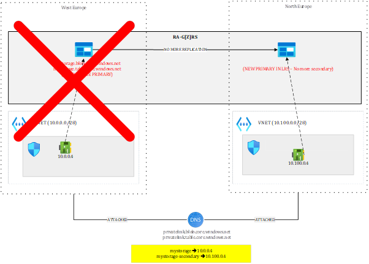
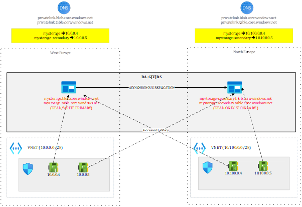

# Disaster recovery with Azure Storage - focusing only on RTO not RPO
Let’s look at Azure Storage, and more specifically to Blob Storage, Table Storage, and Queue Storage, which are widely used across all types of applications. A very common scenario involves Azure Durable Functions as well as stateful Logic Apps, whose default state store is Azure Storage. Because the orchestration state is persisted in Azure Storage, it is essential to understand what happens to this state in the event of a failover.

# Shared DNS zone

For sake of brevity, I will only show how to handle both the blob and table sub resources but the principles are exactly the same with the queue service. Let’s first focus on DNS and private link and why working with a single DNS zone would automatically cause a downtime.

Our shared DNS zones are attached to both virtual networks. From the primary region, I can have two private endpoints, one targeting the primary in West Europe and the other one targeting the secondary in North Europe. Both private endpoints are located in West Europe. Because the FQDN of the Storage Account is mystorage.<service>.core.windows.net, I can only have one record at a time in the DNS zone. I could pre-create the private endpoints in the secondary region but not register them in the zone. In case of Storage Account failover, I would need to update the DNS records and put the IPs of the private endpoints in North Europe. Even doing this wouldn’t work:

With a setup as shown above, if I have one blob “test.txt” in the “test” container, the resulting URIs will be:

-	https://mystorage.blob.core.windows.net/test/test.txt (primary)
-	https://mystorage-secondary.blob.core.windows.net/test/test.txt (secondary)

The primary URL will be reachable from the VM located in the West Europe VNET but not from the one located in North Europe since *mystorage.blob.core.windows.net* resolves to *10.0.0.4*, meaning the private endpoint of West Europe, which is out of reach from North Europe (in this setup). Of course, you could peer those VNETs or route traffic through hubs but this is typically not what you’d want. 
Moreover, after failover, you’d be in a situation as shown below. 

The primary (West Europe) is gone. Perhaps the entire region is gone, meaning that 10.0.0.4 is lost, so even though you would have routed traffic initially from North Europe to West Europe, it’d stop working.
You’d be left with 10.100.0.4 still targeting the secondary but after failover, there is no more secondary...The failover process converts the Storage Account into a Locally Redundant Storage, so the notions of primary and secondary do not exist anymore. The North Europe has just become the new primary, making 10.100.0.4 now pointing to an unreachable target. 
The only way to restore access to https://mystorage.blob.core.windows.net/test/test.txt from North Europe is to create a new private endpoint and update the DNS zone accordingly. You could pre-create the private endpoint prior to a failover but in any case, updating the DNS zone would be required. This would cause a short downtime and requires a scripted plan. At last, the private endpoint targeting the secondary would be working again once you reactivate RA-GRS over North Europe.
So, with Storage Accounts, you must use separate DNS zones if you don’t want any downtime.  That is why, the best setup is the one discussed in the next section.

# Dedicated DNS zones

Each region has its own private DNS zone and each holds a set of private endpoints targeting both primary and secondary. Now, both mystorage and mystorage-secondary are resolved from both sides. From North Europe, a call to mystorage would go through 10.10.0.4 and hit the West Europe location. 
After full regional outage, West Europe is lost but 10.100.0.4 is still targeting the primary, which means, the promoted North Europe location, while the secondary endpoint is lost again. This setup doesn’t require any intervention other than performing the failover itself.
