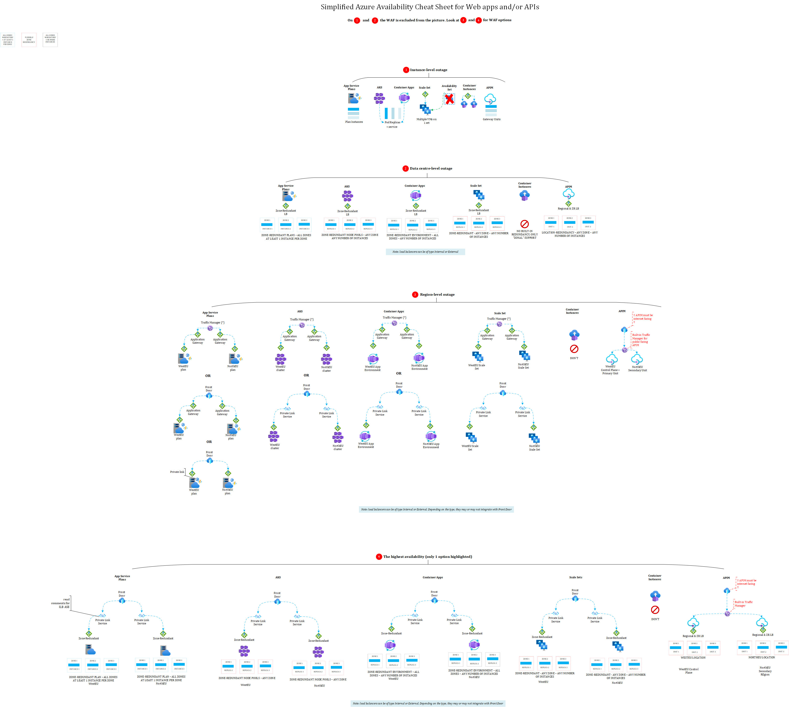

# Availability for web applications and API hosting

# Cheat Sheet 
> DISCLAIMER: I'll try to keep this up to date but the Cloud is a moving target so there might be gaps by the time you look at this cheat sheet! Always double-check if what is depicted in the cheat sheet still reflects the current situation. I discarded the Cross-Region (Global) Load Balancer for multi-region load balancing since it is not especially suited for HTTP traffic (layer-7). I kept Traffic Manager because it was the only option back in the days.

Tip: right click on the image and choose *Open image in a new tab*.

# Attention Points

## (1) Instance-level outage

The first level of availability is the number of instances you run in parallel. Even if you do not leverage any other high-availability mechanism, it's always safer to run at least two instances of a given service, should one instance crash.
With *App Service Plans*, you simply have to define the number of instances you are willing to pay for. With both *AKS* and *Container Apps*, the number of instances is specified via the *replicas* attribute. With *Container Instances*, you must provision **multiple** instances yourself and make sure to ensure a proper load balancing. 

*API Management* let's you choose the number of gateway units you want to run.

At last, with *Virtual Machine Scale Sets* (VMSS), you can simply specify a minimum number of instances of 2, and let it scale automatically to more if needed. In the past, we used *Availability Sets* to have multiple instances of a virtual machine hosted in different hosts. Availability Sets still exist but VMSS is the way to go. The VMSS service is very powerful and is used by many other services under the hoods.

## (2) Data centre-level outage

Azure Regions have multiple independent data centres (depending on the region) called *Availability Zones*. Zones are designed to overcome a serious disaster (fire in one of the zonal DC, power outage, etc.). When deploying resources to Azure, we can choose to make them *zone-redundant* or *zonal* whenever either of these options is available. The way zone-redundancy is supported varies from one service to another. Here are the variants:

- Option 1: all or nothing: in that case, you **must** enable all the available zones within the specified region and you **must** have at least one instance of your workload running in each zone (blue boxes in the diagrams).
- Option 2: all or nothing: in that case, you **must** enable all the available zones within the specified region but you **can** choose the number of instances for your workloads. The system will try to place each running instance in a separate zone (black boxes in the diagrams).
- Option 3: flexible choice: in that case, you **can** choose how many zones you want to enable as well as how many workload instances (red boxes in the diagrams).

App Service Plans force you to go for Option 1. AKS  is flexible (Option 3), while Container Apps are partially flexible (Option 2), but both allow you to deploy any number of replicas and there is no additional costs for enabling zone-redundancy.

Container Instances do not support zone-redundancy but support the *zonal* mode. This means that you can deploy *manually* one instance in zone 1 and another one in zone 2 and ensure load balancing between them.

VMSS support zone-redundancy against any number of zones, which is not surprising since they are used by AKS for the worker nodes. However, it is up to you to provision a zone-redundant load balancer, and the same applies for Container Instances. Only App Services, AKS and Container Apps come with built-in zone redundant load balancer. When it comes to the WAF, you can choose either Front Door, either Application Gateway. Here are a few hints to better understand when to use what:

- Application Gateway can be used for internal apps only, using the private listener, which is not available in Front Door. If you are hosting a B2E app on a single region, Application Gateway is a good choice.
- Front Door is for public facing assets only as it does not have a private listener. It can take a few private backends through private link service, but still not everything, unlike Application Gateway.
- Front Door is a swiss knife as it includes CDN-like features on top of WAF capabilities. It also has advanced routing algorithms.

Zones provide active-active type of high-availability.

## (3) Region-level outage
While zones are a good way to protect against a local disaster, they may not be sufficient to overcome a major disaster such as an earthquake, bombing, etc. To resist to a major disaster, you should deploy your workloads to multiple regions, which are hundreds of miles away from each other. We typically use region-pairing to make sure the distance is not too far (latency) and that there is feature parity across regions. 
When working with multi-region, you first need to check whether you want to have an active-active setup or active-passive. In both cases, you must use either Traffic Manager, either Front Door to handle the load balancing between regions. It goes without saying that both services are only designed to work with **public facing** assets. This means that you would rather rely on your own on-premises load balancers to handle multi-region traffic for internal-only multi-region apps.

Let us assume that we are talking about public facing apps. Both Traffic Manager and Front Door have rich load balancing algorithms to deal with multi-region traffic. A major difference though, is the fact that Traffic Manager is a DNS-based load balancer, which does not effectivement proxy the traffic and has no knowledge of layer-7, unlike Front Door which also performs WAF duties. Front Door is an all-in-one tool, which has my preference over Traffic Manager nowadays. By the way, another technical possible option is to use the *Cross-Region (Global) Load Balancer* but here again, no knowlege about layer-7. I would recommend using Traffic Manager or the Global Load Balancer only for non-HTTP traffic. You may still encounter a few setup with Traffic Manager sitting in front because back in the days, there was simply no alternative.

Clarification made, multi-region workloads often imply:

- A front door with or without application gateway as an origin. You can bypass Application Gateway for any origin that can be linked through *Private Link Service*. This works fine with AKS and Container Apps. Today, if you want to keep your actual backend hosting platform fully private (ie: ILB APIM), you'll need to put an Application Gateway between Front Door and your backend, because Front Door does not integrage yet (in 01/24) natively with such private backends.

- A backend hosting platform in each region. 
- An explicit instantiation of Private Link Service when Front Door takes private origins or directly through private endpoints when applicable (ie: App Service).
- Private endpoints (not shown in the diagrams) and DNS plumbing in each region

So, for our services, we have:

- For App Services:
  - Front Door Standard or Premium + External ASE (because not possible with ILB ASE in 01/2024) in each region.
  - Front Door Premium + ILB ASE **with Private Endpoint enabled** by explicitly enabling them (*--allow-new-private-endpoint-connections*). Still the ILB won't be visible to Front Door but you can let Front Door deploy private endpoints for the web apps hosted on the ASE.
  - Front Door Premium + Multi-tenant App Service Plans + Front Door registered Private Endpoints + VNET Injection for outbound traffic. 

- For AKS:
  - Front Door Standard + External Load Balancer for AKS + Ingress Controller (Gateway). Note that this exposes your cluster to internet, which is typically restricted in most organizations.
  - Front Door Premium + Private Link Service + Internal Load Balancer for AKS + Ingress Controller (Gateway).

- For Container Apps:
  - Front Door Standard or Premium + External Container Apps Environment
  - Front Door Premium + Private Link Service + Internal Load Balancer for the Internal Container Apps Environment.

- For Virtual Machine Scale Sets:
  - Front Door Premium + Private Link Service + Internal Load Balancer + VMSS. You don't want to expose your VMs directly so an Internal Load Balancer is the only secure option.

- For Container Instances: Simply don't. It is technically feasible to cook something but I wouldn't recommend going multi-region with Container Instances for web apps and APIs. You can certainly use them in a multi-region setup to handle background tasks, but you should prefer the other options for HTTP workloads.

- For Azure API Management (APIM):
  - Front Door + External Facing APIM. It can be VNET integrated with *External* mode. In 01/2024, Front Door is not able to take a fully private APIM as an origin. We could expect Front Door to be able to register private endpoints for APIM, but this is not available yet. Moreover, the premium tier of APIM does not allow the creation of private endpoints if it's already VNET integrated...
  - When APIM is external facing, it has its own built-in Traffic Manager instance ensuring the load balancing across regional gateway units.
  - We typically restrict traffic to Front Door using APIM policies that check the presence of a specific HTTP request header that is set by Front Door itself and holds the unique identifier of the Front Door instance.
  - If APIM is VNET integrated in internal mode, you'll need Application Gateway in between. For a pure internal scenario, Azure does not provide any global load balancer that can load balance *internal-only* traffic across regions, so you have to do that on your own.
  - For a complete end to end setup with APIM in multi-region, you can visit [my other pages](../IPaaS/api%20management/multi-region-setup)

> Note that there is one technical alternative if you want to keep your APIM gateway fully private and still use Front Door as the fronting WAF. You can host a self-hosted gateway within AKS. However, you still need to pay for the primary default unit and it slightgly complexify the architecture. 

## (4) The highest possible high availability

Multi-regions and multi-zones are not mutually exclusive. We can perfectly enable both, but this comes at a cost of course! I will not repeat the comments of section 2 and 3 because they apply here as well. 

# Real-world Observations and important notes

- Front Door tends to become the one and only service to use when it comes to multi-region HTTP deployments. 

- Traffic Manager is still present in many setups because it was the only option a few years ago. Azure starts to have its own legacy environments as well.

- Many companies do not use native services to handle incoming internet traffic, and rather rely on their own existing appliances.