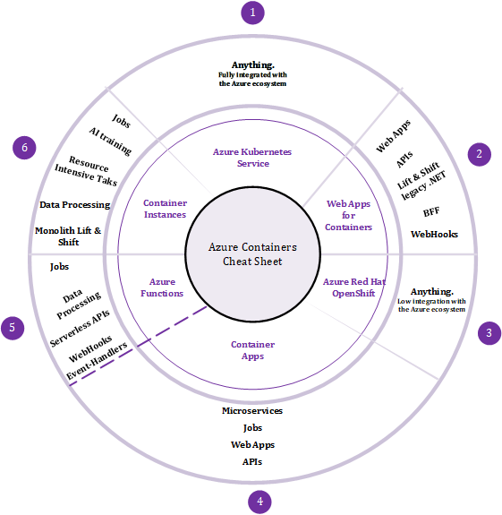

# Azure Containers Cheat Sheet

> DISCLAIMER: I'll try to keep this up to date but the Cloud is a moving target so there might be gaps by the time you look at this cheat sheet! Always double-check if what is depicted in the cheat sheet still reflects the current situation. 

# Attention Points

## (1) Azure Kubernetes Service also known as AKS

AKS is a swiss knife which allows to run any type of workloads. Its flexible architecture using node pools based on underlying *Virtual Machine Scale Sets* allows for many different use cases. While the master nodes are managed by Microsoft, we have full control over the worker nodes. We can use specialized worker nodes to handle specific tasks, which might have different compute needs. On top of the flexible node pool architecture, we can rely on many built-in addons, often originating from CNCF-graduated projects.

On the other hand, the richness and flexibility of AKS makes it also harder to operate and the learning curve is more important than with any other container service from the Azure ecosystem.

## (2) Web Apps for containers

Web Apps for Containers allow you to start your container journey (if not started yet) smoothly. They also accommodate some unique use cases such as lift & shift of legacy .NET apps which might require operating system level access (such as access to the GAC). When performing a lift & shift of some legacy .NET apps over Web Apps for Containers, you can leverage features like autoscaling and a full integration with CI/CD pipelines. You can of course also use them to deploy new web apps and new APIs.

## (3) Azure Red Hat OpenShift also known as ARO

I must admit that I do not have many customers using ARO, so it is hard for me to give you very relevant insights. However, I know a few customers who are running OpenShift on-premises and I had the opportunity to discuss with fellow colleagues.

OpenShift positions itself as a layer on top of K8s, which  abstracts away its complexity. They also pretend to be *more secure* by default. While this seems totally correct, you can achieve the same level of security with AKS by leveraging appropriate tools such as the Azure Policies for K8s, which use *GateKeeper* as an admission controller to restrict any non-compliant workload from being deployed. Azure also comes with *Defender for Containers* to detect life threats while containers are running and to make sure container images are scanned before being used. In terms of complexity, AKS is slowly filling the gaps by adding more supported add-ons which also help work with K8s and get support from Microsoft. In any case, we can safely state that as for plain K8s, ARO can certainly be used for any use case. The factors I would take into account to choose between AKS and ARO are the following:

- What are you using on-premises? Do you already have OpenShift or not. If yes, you might want to go for ARO to have a consistent container journey across environments.
- Do you plan to leverage the broader Azure ecosystem? If yes, you should definitely go for AKS as it is much better integrated with Azure than ARO.
- At last, do you already have OpenShift experts in-house? Based on my experience, it is harder to find OpenShift resources than K8s ones. 

## (4) Azure Container Apps also kown as ACA

ACA has been designed from the ground up to host Microservices. It ships will all the features we typicaly need in Microservice oriented architectures, meaning:

- Easiness of deployment and the out of the box ability to host multiple versions of a given service at a time
- A built-in integration of KEDA (Kubernetes Even Driven Architecture), which helps services scale to handle events.
- A built-in integration of Dapr (Distributed Application Runtime), which helps services to communicate with each other either synchronouly through real service discovery, either asynchronously through message and event brokers. 
- A built-in ingress feature which lets you expose your APIs to the outside world or within the environment itself.
- A built-in integration with different identity providers, which allow you to delegate authentication to Azure itself.

Over the months, ACA added extra hosting capabilities on the form of *Workload Profiles*, which let you decide how much CPU/RAM you want to allocate to a given environment. This concept is comparable to AKS node pools to some extent.

ACA still shines the most for Microservices, APIs in general, web apps and jobs, but with the addition of workload profiles, it can handle more compute intensive workloads as well.
## (5) Azure Functions
Azure Functions have been there for quite a while. They are the ideal service to build Event-Driven Architecture (EDA), thanks to their numerous triggers and bindings. Fuctions act as a glue between different components of an architecture. On top of EDA, functions can help orchestrating workflows through the use of the *Durable Framework*, which turn functions into *Durable Functions*. They can be containerized and hosted on App Service Plans, as well as in any container system. Microsoft made it easier to also host functions on Azure Container Apps, by letting you specify a Container App Environment as the target hosting platform. Azure Functions natively support Dapr, which is also integrated in Container Apps, hence the great match.

## (6) Azure Container Instances also known as ACI and Container Groups

ACI is the ideal service to handle resource-intensive tasks. We can easily orchestrate the dynamic provisioning/removal of container instances through Logic Apps and Durable Functions. ACI lets us allocate a lot of CPU/RAM to a single process, and we can run many of them in parallel (100 per subscription by default but this can easily be extended through a ticket to Microsoft Support). You can also use them in a lift & shift scenario, or for AI trainings. At last, you can even use them as short-lived Azure DevOps agents.

