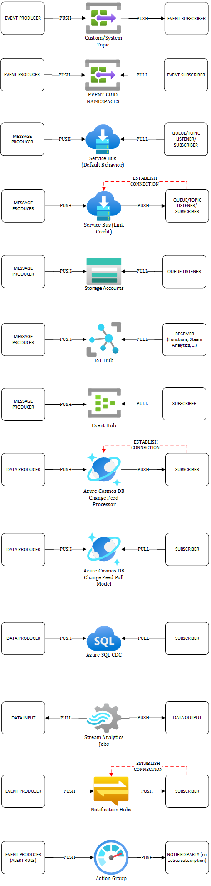

# Network flows in Event Driven Architecture (EDA) using Azure Services

The purpose of this page is to shed some light on the network flows when using data and EDA services. I have seen countless misleading diagrams not showing any flow direction or showing the wrong one. It might seem trivial but a wrong flow direction may be a real impediment for the entire solution. It is important to know whether the EDA services we pick are based on a PUSH/PUSH or PUSH/PULL model and from where the first connection is initially establihed because that is what defines what is really required in terms of connectivity, firewalling etc. Sometimes, this can be counter intuitive. Let us consider the following example to illustrate this:

**Data Producer (PUSH) ==> Cosmos DB ==> Cosmos DB Change Feed (PUSH) ==> Azure Functions**

The above flow is based on a PUSH/PUSH model. The application stores data to Cosmos, which causes the change feed to catch the changes, which in turn notifies Azure Functions about those data events.

However, Azure Functions use the *Change Feed Processor* behind the scenes, which **causes Azure Functions to initiate the connection to Cosmos**. So, although the model is PUSH/PUSH, Cosmos does not need to connect to Azure Functions. Therefore, the focus should be around the Azure Functions' outbound traffic not the other way around. 

Another example to illustrate how important it is to consider who initiates the connection:

**Event Producer (PUSH) ==> Event Grid Custom Topic (PUSH) ==> Subscriber**

In the above example, Event Grid initiates the connection to the subscriber. As of 06/2024, Event Grid requires the subscriber endpoint to be internet facing. If you consider the development of an internal application only used by internal employees (B2E), you might want to avoid having internet facing services. For some reason, you might prefer a PUSH/PUSH model instead of a PUSH/PULL. That's what we call an architecture tradeoff. Either, you use Event Grid and you must foresee a public facing endpoint, either you switch from Event Grid to something else, such as Service Bus and you can keep everything internal. As I told you in introduction, it is crucial to identify these type of things up front as they are very impactful.

The below cheat sheet aims at summarizing the most commonly used services in Event Driven applications. I have added in red, interactions of type PUSH/PUSH where the subscriber initiates the connection.

