Azure offers many ways to replicate data and implement multi-region architectures. The goal of this cheat sheet is to illustrate how resilience can be achieved using the most commonly used Azure services.

For each service, two situations are considered:

- Both regions are operational

- The primary region is completely unavailable

The scenarios also assume isolation from the Internet, as this is the most representative setup for enterprise-grade architectures.

If you test these patterns in your own environment, the primary region will likely remain available, which may give the impression that the system behaves differently. In reality, the architecture is designed to handle a full primary-region outage even if this condition cannot easily be reproduced during testing.

# Azure SQL
In the diagram, I illustrate how geo-replication and failover groups compare. My preference is for failover groups, as they handle DNS more elegantly through static listener endpoints. They also allow you to fail over one or multiple databases together, which is not the case with standard geo-replication.

With Azure SQL Database, the primary and secondary servers automatically discover each other, simplifying the configuration.
## Active Geo-Replication
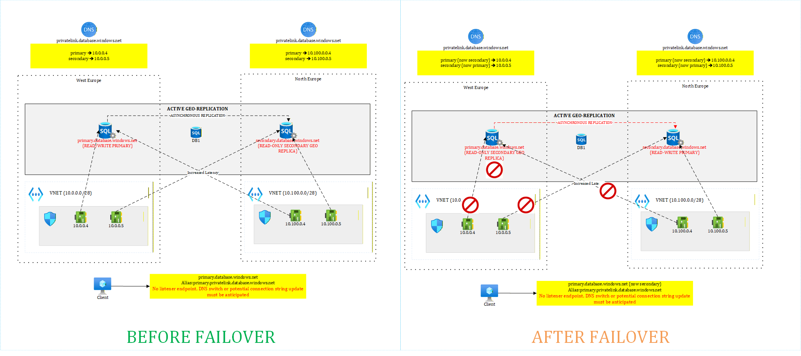

## Failover Groups
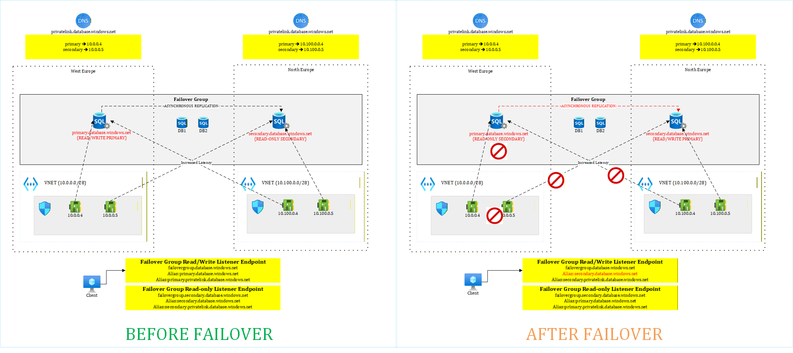

# Azure SQL Managed Instance

Unlike Azure SQL Database, Managed Instances only support failover groups for geo-replication and rely on the customer’s network infrastructure to carry the replication traffic. Therefore, it is essential to ensure that the primary and secondary instances can reach each other through the underlying network and DNS architecture.

Because this connectivity depends on the customer’s network design, multiple implementation patterns are possible.

## Replication through the hubs

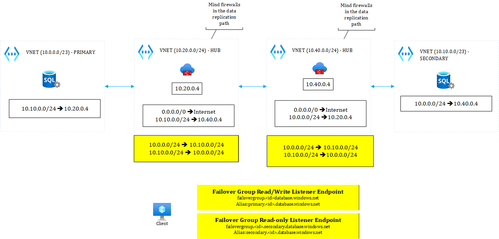

In this setup, each managed instance spoke is peered with its respective regional hub, and the regional hubs are also peered with each other. In some organizations, dedicated integration hubs may fulfill this role instead of relying on a single hub for all connectivity.

Routing must be configured so that the data replication path follows: primary → primary regional hub → secondary regional hub → secondary. Firewall rules must be defined accordingly to allow this traffic, and in *both* directions since the secondary also initiates calls to the primary.

A drawback of this design is that the replication traffic traverses two firewalls. For highly active databases, this may introduce additional load on the firewalls. If the firewalls do not scale adequately, this could ultimately impact the RPO.

## Replication through spokes peering
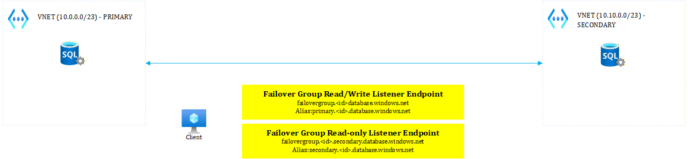

This setup is the simplest, as both Managed Instance spokes are directly peered with each other. No additional configuration is required since the primary and secondary instances can communicate through the peering.

However, the main drawback is that this design does not align with the typical hub-and-spoke topology, where peerings are generally allowed between spokes and hubs only, and not directly between spokes.
## Replication through a hybrid approach
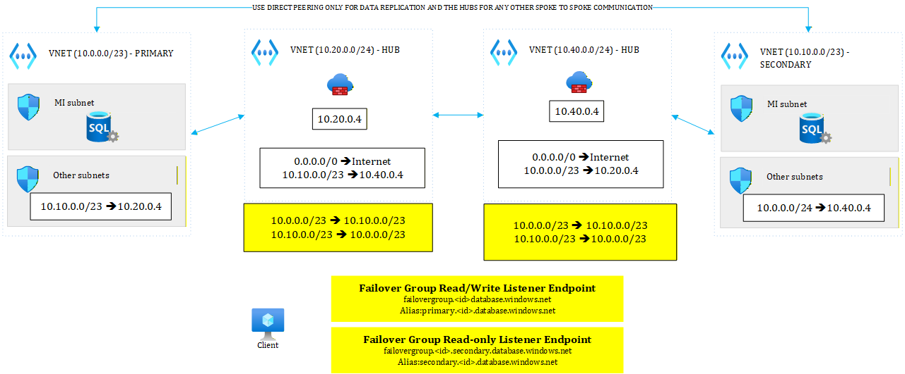
In this setup, both Managed Instance spokes are peered with their respective regional hub and also directly peered with each other. This enables the use of the direct peering for data replication, while all other traffic continues to be routed through the hubs.

The advantage is that replication traffic no longer traverses firewalls, reducing latency and avoiding additional load on them, while firewalls still enforce policies for other traffic flows.

However, this approach again deviates from the traditional hub-and-spoke model, since the two spokes are directly peered. Moreover, because the virtual networks are peered, each VNet can see the entire address space of the other. As a result, a routing misconfiguration on non–Managed Instance subnets could inadvertently allow other traffic to bypass the firewalls.

## Replication through subnet-level peering
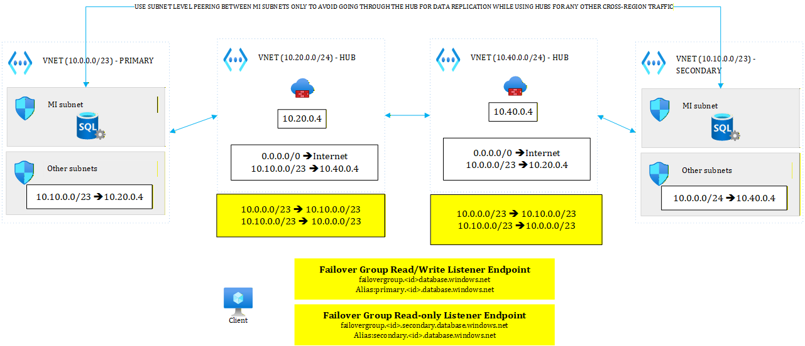
Last but not least, an alternative to the previous setup is to use subnet-level peering rather than peering the entire virtual networks. In this model, only the Managed Instance subnets are peered, allowing the primary and secondary instances to communicate directly, while all other subnets in the two virtual networks can only see the address range of their respective regional hub.

The advantage of this approach is that firewalls cannot be bypassed for any traffic unrelated to the Managed Instances, while replication traffic follows the most direct network path with no additional friction.

However, this design still deviates from the traditional hub-and-spoke topology, since the spokes are partially peered with each other, even though the peering is limited to specific subnets.

## Replication through virtual hubs
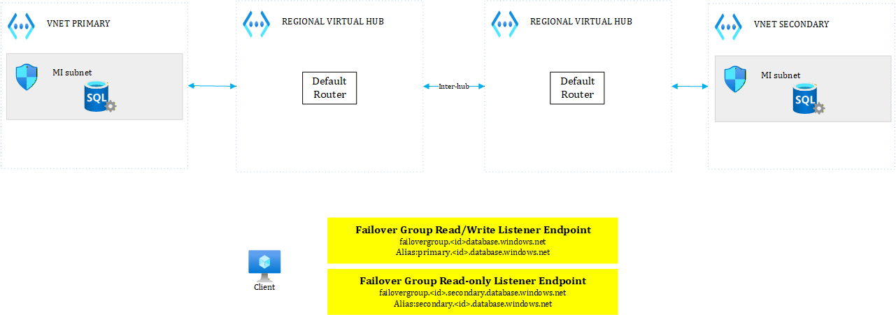
In Azure Virtual WAN, virtual hubs have a default router that let's all spokes talk to each other automatically. Hub to hub communication is also possible providing inter-hub connectivity is configured. In this case, there is no more firewall on the data replication path.

# Cosmos DB single vs multi-region writes
Cosmos DB is well suited for multi-region architectures, as it supports multi-region writes. In addition, the SDKs automatically route requests to available regions, allowing applications to continue operating without any changes on the development side.

In this diagrams, I illustrate both single-write with read-only replicas and multi-region write configurations.
## Cosmos single write
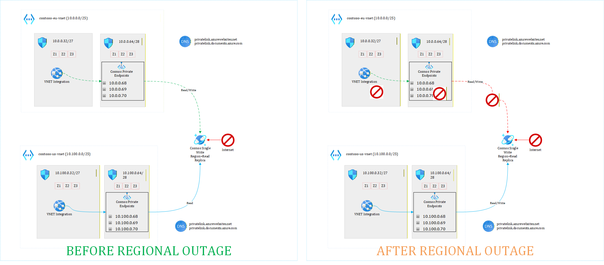
## Cosmos multi-region write
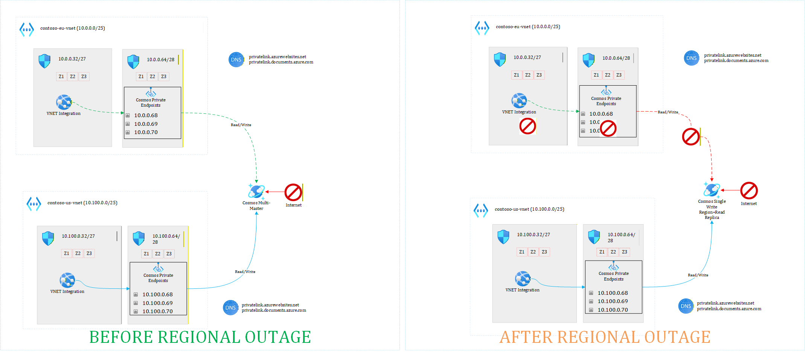

# DocumentDB single vs multiple DNS zones
## DocumentDB single DNS zone
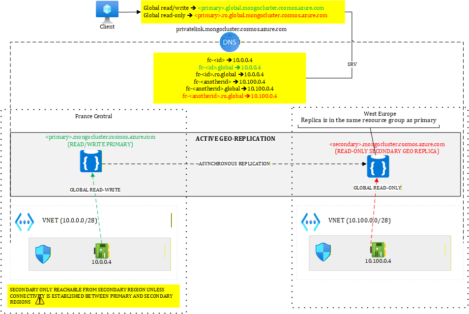
In this setup, a single DNS zone hosts the private endpoint records for both the primary and secondary servers. Because DocumentDB uses SRV record types managed by Microsoft, the global read-write and read-only endpoints resolve either to fc.id.[ro].global or fc.anotherid.[ro].global, where id and anotherid represent the primary and secondary nodes.

To be prepared for failover, it is important to have a private endpoint registered on the secondary server as well and residing in the secondary region's vnet. In our diagram, this corresponds to 10.100.0.4. However, this endpoint is not reachable from the primary region unless the virtual networks are peered directly or connected through a common hub.
In most cases, we prefer to avoid this situation, as it introduces additional cross-region network dependencies. It means that using this setup, you can only talk to the global read-write endpoint from the primary region. Workloads performing read-only operations (if any) should connect from the secondary region. If you want to be able to connect to both global read-write and global read-only endpoints from both regions, consider using two separate DNS zones as shown below.
## DocumentDB multiple DNS zones

In this setup, multiple DNS zones are used to isolate private endpoints targeting both the global read-write and global read-only endpoints, allowing each regional workload to access both endpoints.

This design still introduces cross-region round trips. For example, using 10.0.0.5 from the primary region would reach the secondary instance located in the secondary region. However, the advantage is that no direct connectivity to the secondary virtual network is required.
# Azure Storage

I have illustrated several scenarios, such as Azure Storage deployed in hero regions (e.g., West Europe / North Europe), restricted regions (e.g., France Central), and local regions (e.g., Belgium Central). These types of setups can sometimes introduce architectural challenges and operational complexities.
## Geo-Replication in hero regions
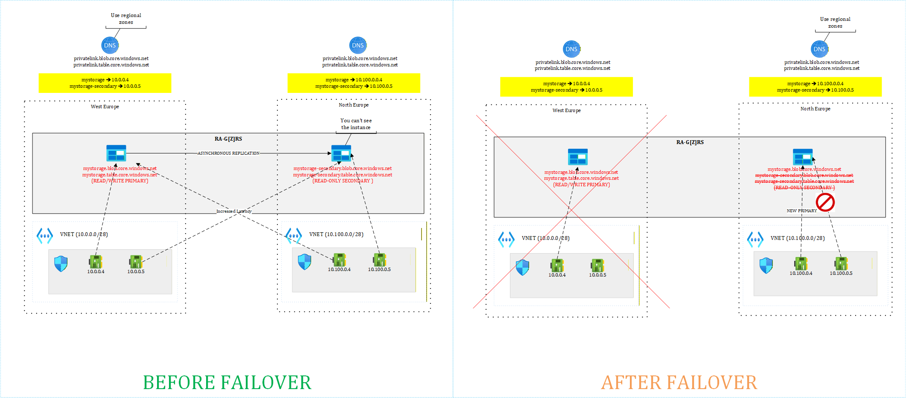
With hero regions, the primary storage account replicates seamlessly to the secondary, while the secondary storage account is fully managed by Microsoft behind the scenes. Two endpoints are available: a read-write primary endpoint and a read-only secondary endpoint when using any of the RA-G[Z]RS redundancy options.

At least one private endpoint pointing to the primary storage account from each region should be configured. It is also recommended to use two separate Private DNS zones so that both private endpoints can be registered simultaneously.

In the event of a failover, DNS is already prepared and the secondary region becomes the new primary. Since both data and compute are co-located in the secondary region, the application can resume operations as soon as the storage failover completes, which significantly improves the RTO.

However, note that data loss may occur in the case of a forced failover.

## Geo-Replication in restricted regions
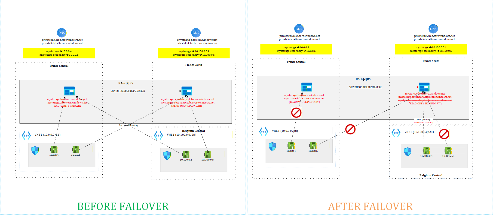
With restricted regions, the primary storage account replicates seamlessly to the secondary, while the secondary storage account is fully managed by Microsoft behind the scenes. Two endpoints are available: a read-write primary endpoint and a read-only secondary endpoint when using any of the RA-G[Z]RS redundancy options.

The key difference compared to hero regions is that compute resources cannot be deployed in the paired region. In this case, one private endpoint pointing to the primary storage account from the primary region should be configured, and another from a different region than the paired one. Ideally, this second region should be as close as possible to the primary region. It is also recommended to use two separate Private DNS zones so that both private endpoints can be registered simultaneously.

In the event of a failover, DNS is already prepared and the secondary region becomes the new primary. However, data and compute are no longer co-located: the storage account remains in the paired region, while compute runs in the region you selected. As a result, additional latency and network costs may occur.

As with other redundancy models, data loss may occur in the event of a forced failover.

## Geo-Replication through Object Replication in any region
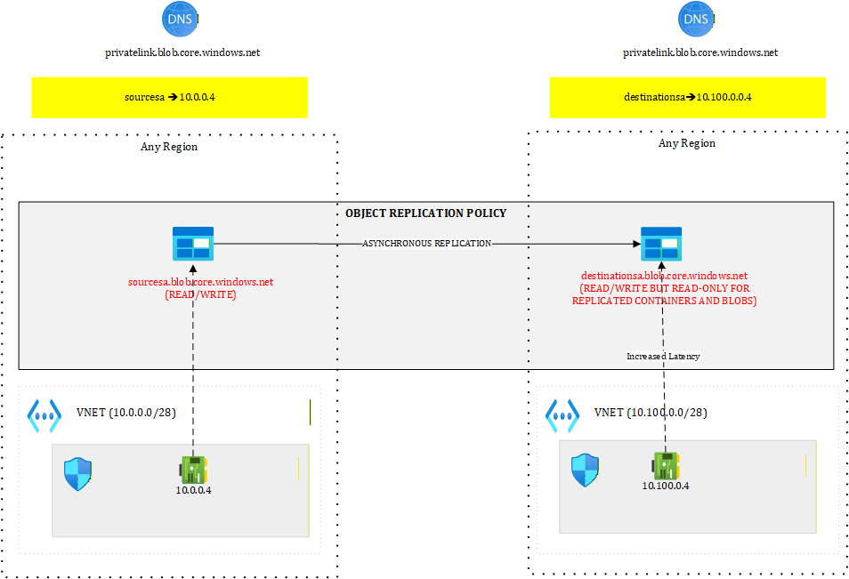
Object Replication is an alternative to GRS for Blob storage only (as of 03/2026). It does not support other storage services such as Queues, Tables, or Files, and it cannot be used with Data Lake Storage.

The main advantage of Object Replication is that it allows replication between any two regions, unlike GRS, which is constrained to Azure region pairs.

When using Object Replication, you must define a replication policy that explicitly lists the containers to be replicated from the primary to the secondary storage account. Unlike GRS, where the secondary is managed by Microsoft, both the primary and secondary storage accounts are separate resources that you fully manage.

# Event Hubs and Service Bus
Next, I show how both Event Hubs and Service Bus deal with geo-replication and geo-disaster recovery. These are related but very different implementations.
## Event Hubs and Service Bus using geo-disaster
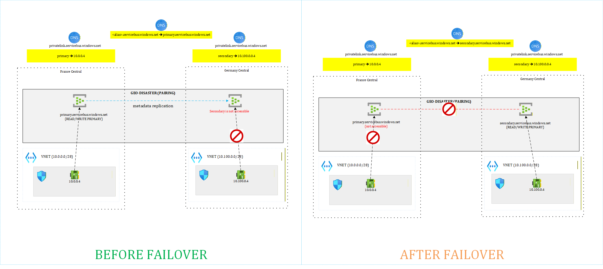
In this mode, Azure only replicates entities, meaning queues, topics and subscriptions, but the messages themselves are not duplicated. In case of failover, the application talks to the new primary but unprocessed messages (if any) from the old primary will only come back once the primary is back.
## Event Hubs and Service Bus using geo-replication
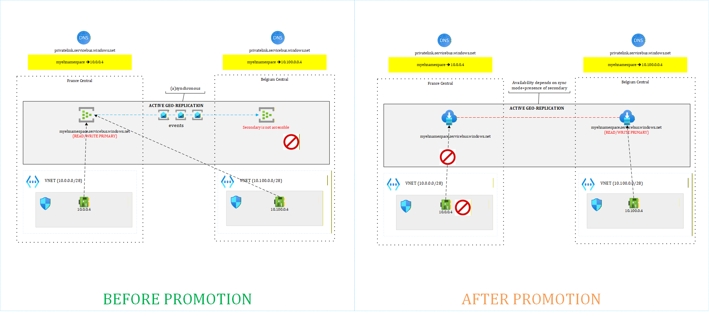
In this mode, replication can be configured as synchronous or asynchronous.
Asynchronous replication may result in data loss, but it offers better performance and does not depend on the availability of the secondary region.
By contrast, synchronous replication impacts performance and introduces a dependency on the secondary region. If the secondary becomes unavailable, the primary will stop accepting writes until the secondary is restored or geo-replication is disabled.

# API Management

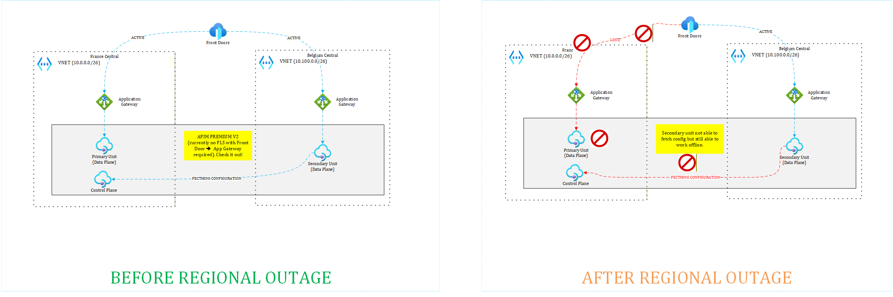
Last, I finish with a first-class citizen in any Azure architecture, namely API Management. I explore a possible setup with APIM Premium v2, which as of 03/2026 doesn't support private endpoints yet and consequently, cannot be directly behind Azure Front Door when not internet-facing. Some other SKUs do support private endpoints but do not have all the APIM features.

# Summary of the replication techniques
| Service Name    | Replication Method | Replica Location | Bundled |
| -------- | ------- | ------- | ------- |
| Azure SQL  | Geo-Replication    | Anywhere | No (separate server) |
| Azure SQL | Failover Group     | Anywhere | No (separate server) |
| Managed Instance    | Failover Group     | Anywhere | No (separate server) |
| Cosmos DB    | Geo-Replication     | Not Visible | Yes |
| DocumentDB    | Geo-Replication     | Same resource group | Separate server but must be in the same resource group |
| Service Bus | Geo-Replication | Not Visible | Yes |
| Service Bus | Geo-Recovery | Anywhere | No (separate instance) |
| Event Hubs | Geo-Replication | Not Visible | Yes |
| Event Hubs | Geo-Recovery | Anywhere | No (separate instance) |
| Storage Account | Geo-Redundant Storage | Not Visible | Yes |
| Storage Account | Object Replication | Anywhere | No (separate instance) |
| API Management | Units | Anywhere | Yes |