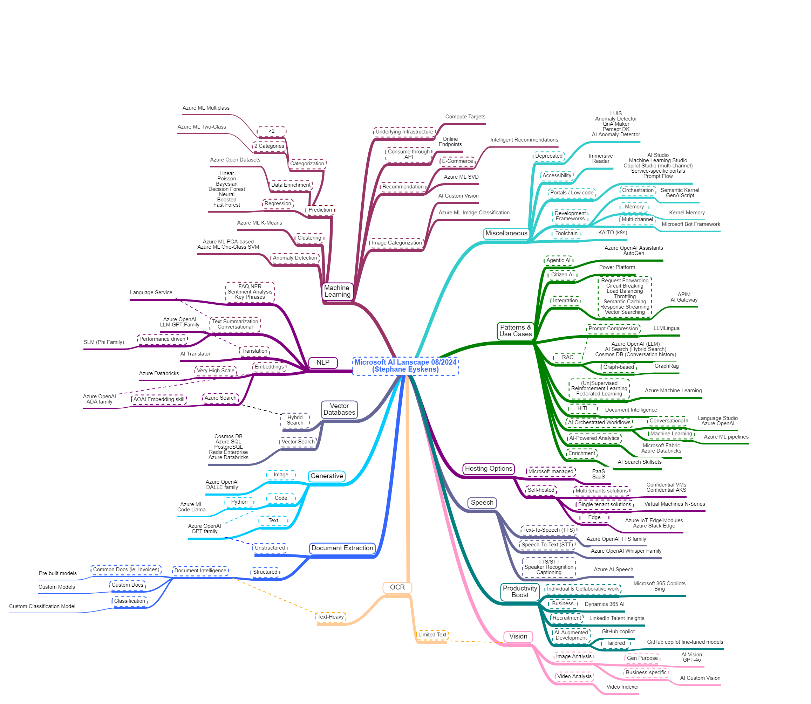

# The Microsoft AI Landscape Map
## Disclaimer
> DISCLAIMER: AI is a fast moving area so the map is certainly not exhaustive. I'll however try to keep it up to date.

## Introduction
Note: here is a pointer to the [original map](https://app.mindmapmaker.org/#m:mm9699b1945d814c5eae42697b078356c4).

The purpose of this map is to help you find your way in the Microsoft-only AI world. The map is aimed at consolidating the most frequently used AI services. It is by no means exhaustive! I mostly focused on AI services that can help you build solutions but the Microsoft AI world is broader than this since nearly every modern Microsoft product is infused by AI.

## Categories
### Machine Learning
Whether you need to perform *predictions*, *anomaly detection*, *recommendations* or *clustering*, Azure Machine Learning is your next stop shop. There is also a handy cheat sheet available [here](https://learn.microsoft.com/en-us/azure/machine-learning/algorithm-cheat-sheet?view=azureml-api-1)  

### NLP - Natural Language Processing
NLP: the main tasks associated with text analytics. Most tasks can be accomplished with Large Language Models (LLM) such as GPT but some Azure services were specifically trained to handle NLP operations such as NER (Named Entity Recognition) and the likes. I also shed some light on the different options to generate text-embeddings.
### Vector Databases
Text embeddings as well as any other type of embeddings (image, audio, etc.) are to be stored in a vector database. Azure has quite many of them.
### Generative
In the era of Generative AI, Azure OpenAI is paradigm but I try to shed some light on the most frequently used LLM families, given a certain purpose.
### Document Extraction
Document Intelligence is Micrososft's rock star when it comes to handling documents, although Azure OpenAI can also be used for some tasks.
### OCR - Optical Character Recognition
Here again, Document Intelligence is the primary choice but Computer Vision can also be used providing documents are lightweight (such as an image with text for instance).

### Vision
Anything related to image and video analysis/classification.

### Productivity Boost
This section regroups some tools/assistants that help you be more productive. Such tools are Microsoft Copilots, GitHub Copilot, etc. I use them on a daily basis. 

### Speech
Anything related to text-to-speech, speech-to-text and speaker recognition.

### Hosting Options
The different options available to run AI at the edge, on-premises and in the Cloud. I'm also trying to emphasize the importance of Confidential Computing for multi-tenant AI solutions. This is particularly important if you plan to build a SaaS solution hosted on Azure that you sell to customers. This could also apply to internal tenants depending on regulatory obligations.
### Patterns & Use Cases
I shed some light on typical patterns such as RAG, AI gateway, etc. and the typical way to address them.
### Miscellaneous
A diversity of services and tools you can use to build AI solutions.

## Online MindMap Maker tool
The [original map](https://app.mindmapmaker.org/#m:mm9699b1945d814c5eae42697b078356c4) is available online. Since this free online tool archives every map that is older than a year, here is a direct link to the corresponding [JSON file](./AI-landscape.json), which you can reimport in the online tool should the map not be available anymore.