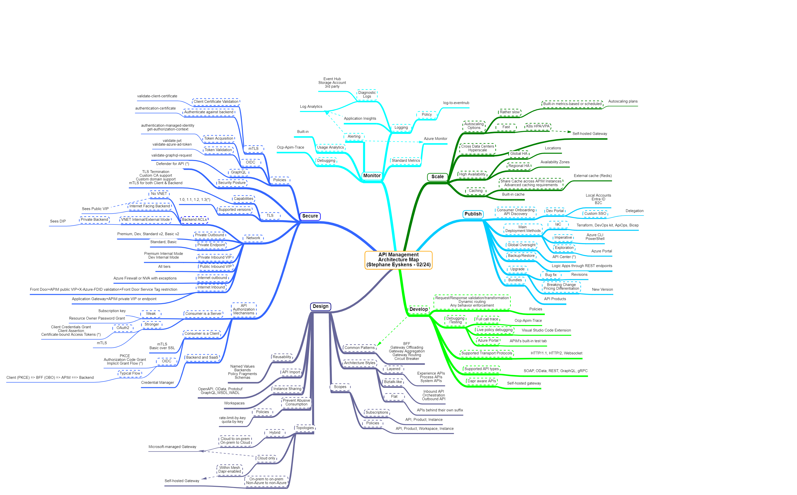

# The API Management Architecture Map
## Disclaimer
> DISCLAIMER: I'll try to keep this up to date but the Cloud is a moving target so there might be gaps by the time you look at this map! Always double-check if what is depicted in the map still reflects the current situation. 

## Introduction
Note: here is a pointer to the [original map](https://app.mindmapmaker.org/#m:mm86e9715800bc436ca62d6433948fc39b) is available online

Azure API Management (APIM) has become a broad service with many features and there are many things to think about when dealing with the service. The purpose of this map is to be a one stop shop to assess the different options about Securing, Monitoring, Designing, Scaling, Publishing and Developing APIs. Items marked with an asterisk (*) are/were in preview at the time the map was first published.

## Categories
### Logging & Monitoring
It goes without saying that logging and monitoring are key aspects of anything you design. With APIM, you can leverage Application Insights, which in turn, sends its logs to a central Log Analytics workspace. If you have multiple APIM instances, each should have its own Application Insight but all can be sent to the same Log Analytics workspace to have a single pane of glasses. Standard metrics are automatically captured by Azure Monitor and you can use them, as well as Log Analytics, to define alert rules. Logs can also be sent in parallel to Event Hub in case you want to let typical enterprise solutions such as Splunk and QRadar ingest them all.  

### Scaling
Scaling APIs can be understood in several ways:

- Having few APIs but a very heavy workload
- Having many APIs
- Having APIs in many different data centers
- All of the above

In any case, you are likely to multiply the gateway units to accomodate all the above scenarios. When adding extra gateway units, you should always envision the use of Availability Zones (and/or regions) to combine both scalability and higher availability. Of course, adding gateway units come at a cost, so you might be tempted to rely on autoscaling to scale dynamically and reduce costs. While this is typically a good strategy, it might not be ok with API Management because the built-in autoscaling of Microsoft-managed units takes time and is unlikely to be ok for very dynamic peak loads. However, when your peak loads are predictable, you could rely on scheduled autoscaling. When dealing with unpredictable peak loads, you might want to rely on the Consumption tier (if you can afford its limitations, being less control, less policies, no buit-in cache, etc.), or rely on the self-hosted gateway to take advantage of its immediate (a matter of seconds) scaling capabilities.

Another way to support high load is to make use of caching. APIM has a built-in cache whose the limits vary according to the pricing tier. Whenever the built-in cache becomes a limiting factor, you can rely on the *External Cache* and use *Redis*, which you attach to APIM.

### Publishing APIs
There is a diversity of tools available to publish and deploy APIs. *Terraform* is my prefered option but you can use any IaC language, except perhaps ARM which is really not suitable for API Management. Whatever tool you use, you should always version your APIs as a best practice. Revisions can be used to do bux fixing or minor changes and then be promoted to the current version or a new version. Any breaking change should lead to a new version. API products can be used to regroup together a bunch of APIs that altogether make a product, that you intent to sell to your customers, or simply make available through the *Developer Portal*. The latter can be used to let API consumers discover/test and subsribe to your APIs. At last, do not forget to take backups of your API Management, especially if you use local users or let the service generate its own subscription keys. All that info is stored in APIM's dataplane. Accidental deletion of the instance is automatically covered by APIM's soft-delete behavior, but if you corrupt the data in any way or only partially delete it, you'll need a backup to restore the state. As a best practice, a daily backup, typically handled by a scheduled *Logic App* does the job. Beware that APIM's management plane is frozen while the backup is running (typically about 10 minutes).
At last, to keep track of all APIs, you can use the brand new *API Center* service.

### Designing APIs

##### Patterns
Many design patterns such as *Backend for Front End*, *Gateway Offloading*, *Gateway Aggregation", etc. may be partially or entirely offloaded to APIM itself. For instance, you may perfectly have two different APIs on APIM targeting the same backend service, but performing response transformation according to which frontend (mobile or web client) is calling. You could as well use APIM's synthetic GraphSQL support for one specific frontend while the other frontends would simply use a more traditional REST approach, both targeting the same backend services. Similarly, the *Gateway Offloading* pattern can be delegated to APIM to let it apply authorization, rate-limiting policies etc.
##### Architecture Styles
You can use APIM in a flat way, meaning that all APIs are behind their own respective suffix. This is the default behavior. However, you may decide to adopt a layered API approach, which consists of distinguishing different types of APIs and define clear boundaries across these types. What is not so well-known about APIM is that you can use the *localhost* keyword to remain within the boundaries of the API gateway and let those API layers communicate with each other. An alternative consists of a Biztalk-like method with inbound and outbound APIs and an orchestration layer in between, which is a centralized way of integrating systems.
At last, in the era of containers and Service Meshes, you may decide to make APIM part of your mesh. This can be achieved  thanks to the self-hosted gateway, which can be injected by the mesh. The self-hosted gateway connects to the same management plane as the Microsoft-managed ones, and is able to work offline should the connection to APIM's management plane be lost.

##### Topologies
For Azure to Azure API operations within the same region, you may favor Microsoft-managed gateways, unless scalability or specific scenarios (mesh, Dapr, etc.) would lead you to pick the self-hosted gateway. For any on-premises to on-premises API integration, you should use the self-hosted gateway (or another API Management product), rather than the Microsoft-managed ones, because they would cause an additional roundtrip to an Azure data center, which does not make sense if both backend services are on-premises. This consideration is also valid for any non-Azure data center.

### Securing APIs
##### VNET integration and backend ACLs
As often in Azure, the networking bits are not the easiest one. APIM has many different pricing tiers, all coming with their own networking limitations. There are many moving parts but at this stage, only APIM DEV & Premium tiers have a full VNET integration (both inbound and outbound) with no restriction. The others have either inbound isolation, either outbound but not both at the same time. Make sure that this is still the case by the time you read this page.
When you want to restrict the access to backend services to APIM only, you will either use APIM's public VIP, either APIM's outbound subnet, according to whether APIM is integrated with a VNET or not, but also according to whether the backend itself is public or not. APIM makes use of two types of IP addresses when connecting to backend services, namely the VIP and the DIP. I encourage you to see a comprehensive explanation in [this blog post that I wrote a while ago](https://techcommunity.microsoft.com/t5/azure-developer-community-blog/azure-api-management-networking-explained/ba-p/3274323).

##### TLS
TLS 1.3 is not yet available but [has been announced in preview](https://techcommunity.microsoft.com/t5/azure-integration-services-blog/announcing-the-availability-of-tls-1-3-in-azure-api-management/ba-p/4047586) so it should be rolled out anytime soon. However, APIM can perform TLS termination and can trust custom Certificate Authorities. Beyond TLS, APIM is able to handle mTLS for both, incoming calls and outgoing calls.

##### Typical security policies
APIM has many different policies but some are first-class citizens when it comes to securing your APIs. These are named and listed on the map.

##### Security Posture
You can enable *Defender for API* to have an end-to-end assessment of your APIs. Defender will check whether endpoints are subject to authentication and help you caterogize them. It also ships with a live threat detection module that can raise alerts in case of anomaly detection (unsual bandwidth usage), or any of the OWASP API top 10 threats. I would still recommend to put a Web Application Firewall (WAF) in front of APIM for internet facing APIs.

##### Authorizations based on the consumer
*OAuth* and *OIDC* have become mainstream. The type of flow you can use vary according to the type of client consumer. Any mobile, browser-based and other *native* clients should only leverage interactive flows such as the *PKCE* one. Any server-side component (ie: backend calling another backend, background job, etc.) can leverage the *Client Credentials Grant* as well as the *Resource Owner Password Grant*, although the latter is considered weak. Beyond OAuth and OIDC, server-side components can use *Subscription keys*, while this method is strictly not recommended for client devices. Both, client and server-side consumers can leverage mTLS.

### Developing with APIM
*Visual Studio Code* is your best friend thanks to its *Azure API Management* extention that enables live debugging of APIM policies, among other things. When using Postman, Fiddler or similar tools, you can add the *Ocp-Apim-Trace* HTTP request header to get a full trace of the API call (tracing must be enabled up front).   

## Online MindMap Maker tool
The [original map](https://app.mindmapmaker.org/#m:mm86e9715800bc436ca62d6433948fc39b) is available online. Since this free online tool archives every map that is older than a year, here is a direct link to the corresponding [JSON file](./apim.json), which you can reimport in the online tool should the map not be available anymore.

