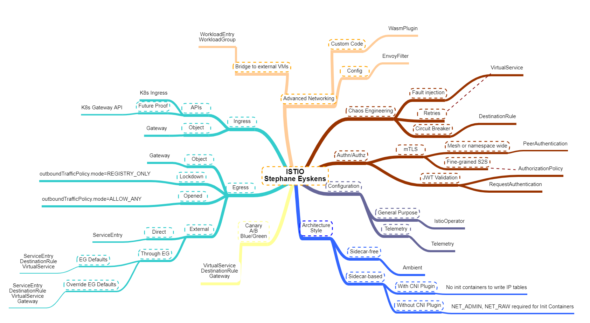

# The Istio Map
## Disclaimer
> DISCLAIMER: I'll try to keep this up to date but the Cloud is a moving target so there might be gaps by the time you look at this map! Always double-check if what is depicted in the map still reflects the current situation. 

## Introduction
Note: here is a pointer to the [original map](https://app.mindmapmaker.org/#m:mm7341d0483ebd4fba9ad2465f550d0f5d).

https://app.mindmapmaker.org/#m:mm7341d0483ebd4fba9ad2465f550d0f5d
Istio is a first class citizen in the world of Service Meshes. It has been adopted by Microsoft as the default Azure mesh for AKS although, not every feature is available through the AKS addon. For everyone looking at adopting a Service Mesh, you can always compare some of the available options [here](../cheat%20sheets/aks.md).

The map is rather small and does not require further explanation per say. I would give you only two advices if you start greenfield with Istio:

- Adopt it gradually
- If you are just exploring, try to already leverage the [ambient](https://istio.io/latest/docs/ops/ambient/getting-started/) flavor as well as favor the use of the *Gateway* API instead of the *Ingress* one.

## Online MindMap Maker tool
The [original map](https://app.mindmapmaker.org/#m:mm7341d0483ebd4fba9ad2465f550d0f5d) is available online. Since this free online tool archives every map that is older than a year, here is a direct link to the corresponding [JSON file](./istio.json), which you can reimport in the online tool should the map not be available anymore.