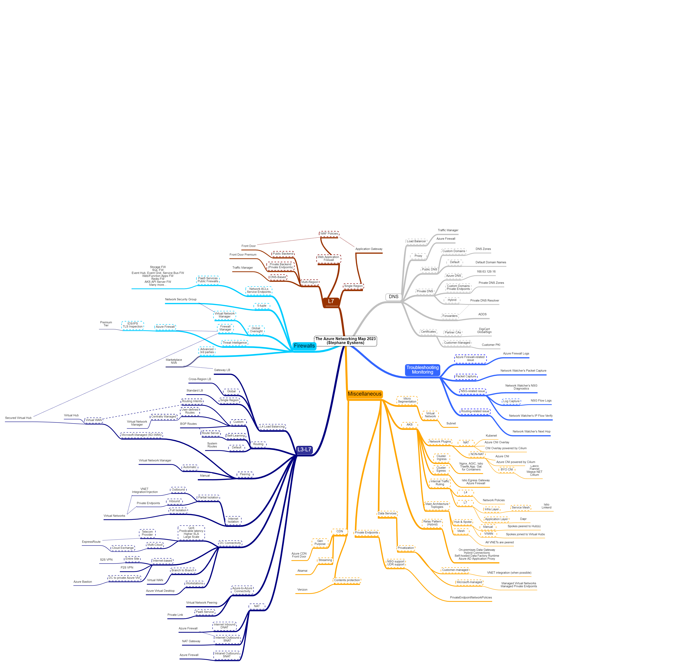

# The Azure Networking Map
## Disclaimer
> DISCLAIMER: I'll try to keep this up to date but the Cloud is a moving target so there might be gaps by the time you look at this map! Always double-check if what is depicted in the map still reflects the current situation. 

## Introduction
Note: here is a pointer to the [original map](https://app.mindmapmaker.org/#m:mma6909a961d384a8b8a835587d479df24).

The Azure networking piece is a broad and important aspect of Azure. 

## Categories
### L7
This category describes the available reverse proxies and WAF.

### L3-L7
The different connectivity and routing options. Key choices:

- **Expressroute or VPN or both**
- **Manual Hub & Spoke or Azure Virtual WAN**

### Firewalls
The different types of available firewalls.

Key choice: **NVA or Azure Firewall**.

### DNS
The different Azure DNS services and their use. 

Key choice: **Private DNS Resolver or extend your Infoblox**.

### Trouble shooting and monitoring
This section helps figure out how to keep track of network-related logs and how to troubleshoot.
### Miscellaneous
A few typical network concerns.

## Online MindMap Maker tool
The [original map](https://app.mindmapmaker.org/#m:mma6909a961d384a8b8a835587d479df24) is available online. Since this free online tool archives every map that is older than a year, here is a direct link to the corresponding [JSON file](./network.json), which you can reimport in the online tool should the map not be available anymore.