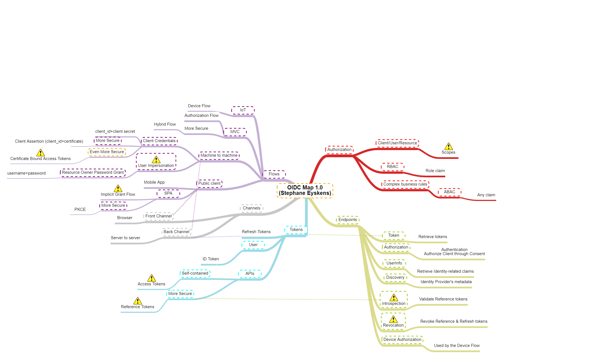

# The OIDC Map
## Disclaimer
> DISCLAIMER: I'll try to keep this up to date but the Cloud is a moving target so there might be gaps by the time you look at this map! Always double-check if what is depicted in the map still reflects the current situation. 

## Introduction
Note: here is a pointer to the [original map](https://app.mindmapmaker.org/#m:mm874d2549d9ee49cb83b34043b5a95dab).

OpenID Connect (OIDC) is in the air for quite a while. I am still impressed by the lack of knowledge of most developers and security pros in that matter. The purpose of this map is to highlight the main OIDC areas and its vocabulary.

I have added a few warning icons. Read below if you want to know more.

## Categories and attention points
### Flows
Flows are initiated by a client or a server. A client could be a mobile device, a browser, an IoT device. A server could be an API calling another API, a background job, etc. Typically, clients involve a human interaction such as login in, while servers do not. The type of flows you can use depends on whether you're trying to acquire a token as a client or as a server. Whether you work with a client or a server, you will need to register an application at the level of the IDP (ie: Entra ID, Keycloak, Identity Server, etc.).
#### Attention points
##### User Impersonation as a Server
The Resource Owner Password Grant is a flow that enables a server-side component such as a job or a service to acquire an access token on behalf of a *user*. The type of user in this case is similar to a *Service Account*. This type of account does not represent a human user. This flow should be avoided as much as possible but remains a possibility if a technical constraint is pushing you to use it. Such technical constraints could be the lack of support by the targeted resource of any other flow. For machine to machine authentication, you would rather favor the user of the *Client Credentials Grant*, which consists of using a pair of *ClientId/Client Secret* or *ClientId/Client Certificate*. The latter is considered more secure since the client has to sign his token request with a client certificate.
##### Certificate Bound Access Tokens
This type of tokens typically encompass the thumbprint of a certificate that is *associated* to the client app. They are typically linked to the Client Credentials Grant but the Authorization Server must support it, which is not the case of Entra ID.
##### Implicit Grant Flow
The Implicit Grant Flow used to be the only flow that was available for Single Page Applications (SPA). It is strongly discouraged to still use that today but you might see this in legacy implementations. You should favor the use of the *PKCE* flow instead because it is considered more secure. It helps prevent MITM attacks by making sure you cannot introduce a new actor between the relying party and the IDP during the final redirection. Note that switching from Implicit Grant Flow to PKCE requires a code change.  
### Token types
OIDC added an identity layer on top of OAuth, which was initially designed for authorization purposes. *ID Tokens* typically contain information about the logged in user, *Refresh Tokens* allow a client application to request new *Access Tokens* silently on behalf of the logged in user. This is to make sure the users do not have to re-login over and over again. At last, *Access Tokens* are used to gain access to a resource server (ie: an API).  
#### Attention points
##### Access tokens with Entra ID or External Identities or B2C
Access tokens issued by Entra ID and Microsoft-managed IDPs in general are *Value Tokens*, which means that they are self-contained and anyone in possession of such a token will be able to consume the resource it was issued for until the token expires. I always compare this to the keys of a house. If you find the keys (or steal them) and know where the house is, you can get in while not being the owner and without breaking the door. Value tokens cannot be revoked. They become invalid once expired. It is therefore a good practice to shorten their lifetime and to make sure their scope is strickly restricited to the minimum required.
##### Reference Tokens aka Opaque tokens
Unlike *Value Tokens*, *Opaque Tokens* are not self-sufficient. The resource server still needs to validate with the IDP if the token is valid. They can be revoked at any point in time. While they are more secure than value tokens, they add a solid pressure to the IDP since any API call results in an extra roundtrip to the IDP. Entra ID and Microsoft-managed IDPs do not support them, probably for scalability reasons. Other IDPs such as Identity Server do support them but I would still restrict their usage to only sensitive APIs, to avoid scalability issues.
### Endpoints
Endpoints are API endpoints exposed by the Identity Provider and called by clients to initiate OIDC flows. They vary according to the IDP capabilities. 
#### Attention Points
##### Unavailable endpoints in Entra ID
Introspection (used among other things together with Reference Tokens) and Revocation (used to revoke existing tokens) endpoints are not available in Entra ID. While Entra does not provide a revocation endpoint, it is yet possible to revoke refresh tokens by resetting the user password or disabling it, as well as explicitly revoke all user sessions. 
### Authorization
As you can imagine, the ultimate purpose of acquiring access tokens is to be authorized to consume resources. It is up to the resource server to validate whether the provided access token is valid or not and whether the intended operation is allowed or not. You can typically rely on two methods:
- RBAC: Role-based Access Control is achieved by inserting role names into the *role* claim. In Entra ID, you can easily get roles injected when using *User and Group Assignment* and mapping security groups to application roles. 
- ABAC: Attribute-based Access Control goes beyond mere RBAC as it allows you to combine multiple claims present in the token to apply advanced business rules. For example, you might expose an endpoint that can be consumed by 'Subscribers' but restricted to the 'US' location. In that case, you would check the value of both the *role* claim and the custom *location* one to grant or deny access. ABAC typically involves claims augmentation.
#### Attention Points
##### Scopes
A common misunderstanding is to think that scopes alone should be used by the Resource Server to grant or deny access to a given operation. While they should be checked, they are not sufficient. Scopes exist to model APIs and to grant *Clients* (apps registered in the IDP, not users) to access *Resources* on behalf of a user. This does not prevent the Resource from double-checking the actual permissions of the user who authorized the app to interact with the resource on his/her behalf. 

Here is a sample scenario to make it more clear:

User U has a limited read-only access to some documents in SharePoint Online. Your organization decides to add a third-party app from the Office 365 marketplace that interacts with SharePoint. The app requires the following Microsoft Graph permissions *Sites.Manage.All*, which does not even require an admin consent. User U starts using the app and consented to the *Sites.Manage.All* permission. The third party application is now allowed to interact with SharePoint Online on behalf of User U, up to *Sites.Manage.All*. However, User U only has read access to some documents. If the third-party app tries to create a new list in the current site collection, SharePoint will deny it because User U does not have write permissions. Your own resources should behave the same way and not merely rely on the presence of a given scope in a token. I have seen numerous implementations that were only checking if a given scope was present or not in the token. In the above example, this would have turned to let a read-only user create (write) items. 

## Online MindMap Maker tool
The [original map](https://app.mindmapmaker.org/#m:mm874d2549d9ee49cb83b34043b5a95dab) is available online. Since this free online tool archives every map that is older than a year, here is a direct link to the corresponding [JSON file](./oidc.json), which you can reimport in the online tool should the map not be available anymore.