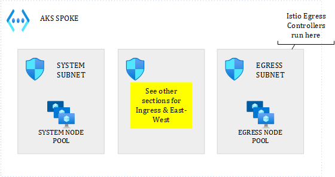

# The different ways to manage egress traffic in AKS

Egress traffic is traffic that leaves the AKS cluster. Such traffic is often destined to Internet but could also reach out to a privatelink-enabled PaaS service. The latter can be considered East-West traffic from a broader perspective but remains egress for AKS. No matter how you consider it, you will typically route such traffic to a different appliance according to the actual destination (internet or not). By default, AKS clusters have a built-in load balancer that is used to let traffic go to Internet. You can decide to route the traffic to an Azure Firewall or an NVA intead. Before ruling how traffic that has already left the cluster should be routed, let us see what we can already do from a cluster perspective.

# Using Calico to manage egress traffic - typically in a shared cluster context
When using Calico, you typically apply a Global Deny policy to lockdown pod-level egress traffic. This policy not only applies to cluster egress but also to internal traffic. You then deploy namespace-scoped or a global policy that allows one or more namespaces to reach the targeted destination. I explained Calico, along with concrete examples in the [East-West section](https://github.com/stephaneey/azure-and-k8s-architecture/tree/main/networking/azure-kubernetes-service/east-west-traffic).

# Using Istio to manage egress traffic - typically in a shared cluster context
Istio, now natively available with AKS, can be used to manage egress traffic as well. Beyond simply allowing/denying traffic, Istio has a unique offering that consists of routing traffic to its built-in egress gateway. Istio allows you to lock down egress traffic by setting *outboundTrafficPolicy* to *REGISTRY_ONLY*. With this enabled, traffic destined to unknown services will be blocked by default. Internet services or services outside the cluster will be unkown to Istio. Sometimes, even internal services such as Dapr ones are also unknown because they use port names that are not recognized by Istio. 

To bounce on the Dapr example, when using it together with Istio, you will have to allow dapr-enabled applications'sidecar to reach out to the Dapr controlplane, which you typically do not inject. With egress locked down by default, this would result in the following situation:


where the *daprd* sidecar would not be able to reach out to *dapr-sentry* nor any other services exposed by Dapr's controlplane. To solve this, you must explicitly add an Istio **ServiceEntry** : 

```apiVersion: networking.istio.io/v1beta1
kind: ServiceEntry
metadata:
  name: dapr-controlplane
  namespace: istio-system
spec:
  hosts:
  - dapr-sentry.dapr-system.svc.cluster.local  
  - dapr-api.dapr-system.svc.cluster.local  
  - dapr-placement.dapr-system.svc.cluster.local  
  location: MESH_EXTERNAL
  ports:
  - number: 443
    name: https
    protocol: TLS
  resolution: DNS
```    
to either the application namespace, either Istio's root namespace to let every meshed pod talk to the Dapr controlplane. This type of traffic is considered egress from a pod perspective, not from a cluster one, which is the reason why you shouldn't leverage Istio's egress gateway for this, while still having to add Dapr's controlplane to Istio's service registry. 

On the other hand, you would still have to manage two extra situations:

- Traffic destined to privatized PaaS services or any other Azure-hosted service 
- Traffic destined to Internet 

In both cases, such traffic leaves the cluster and now it becomes interesting to leverage the Egress Gateway as explained in the next section. 

## Leveraging the Istio Egress Gateway - typically in a shared cluster context
If you plan to use the Istio Egress Gateway, I recommend you to isolate the gateway into its own node pool and its own subnet, as shown below.



The purpose of the egress gateway is to enforce Istio-level policies. You should only allow the egress gateway subnet to talk to your PaaS services from a Network Security Group/Firewall perspective. This approach allows you to shift the management of egress traffic to the cluster itself in a Cloud Native way.

# Using both Istio and Calico to manage egress traffic - typically in a shared cluster context

Istio and Calico are not mutually exclusive. On the contrary, they complement each other and ensure a defense in depth approach by combining different layers of controls. As we saw earlier, both Istio and Calico help manage pod level egress, which is also the reason why they can both be used to also handle [East-West traffic](https://github.com/stephaneey/azure-and-k8s-architecture/tree/main/networking/azure-kubernetes-service/east-west-traffic) within the AKS cluster itself.

# Using an external appliance to manage egress traffic - for both dedicated and shared clulsters
Whether you use Calico and/or Istio or not, you will typically use an NVA or an Azure Firewall to filter (and possibly inspect) traffic destined to Internet. You will usually be confronted to the following situation:

- You use a single firewall for every type of traffic 
- You use specialized firewalls such as one for spoke-to-spoke, one for internet ingress, one for internet egress, etc.

Note that a firewall is recommended even if you use both Istio and Calico because these technologies only apply to containers, not to the underlying nodes. In any case, you want to make sure that the nodes themselves are controlled.

As highlighted earlier, traffic leaving the cluster is considered egress for AKS but such traffic can target either internet, either other Azure endpoints such as private endpoints like for instance, when a pod needs to reach out to a private-link-enabled database. The toplogies below shed some light on how you should route traffic according to the number of firewalls you have.

## Single Hub & single firewall for everything


In the above setup, all traffic but intra-VNET traffic is sent to the hub. Note that intra-VNET traffic could also be sent to the firewall but this is typically not done because we usually rule intra-vnet traffic with *Network Security Groups*. You'll be able to route traffic to the hub through the use of *User-Defined Routes*.

## Multi Hub Architecture


In the above setup, you work with traffic-specific hubs where each hub only deals with specific duties (ie: internet egress, east-west, internet ingress, etc.). The principle is the same as before but this time, you'll need to differentiate the routes in your *User-Defined Routes*, according to whether the traffic is destined to internet or the internal perimeter.

# Summary
The Cloud native way of managing egress traffic typically involves using Network Policies (k8s or Calico) together with a Service Mesh. It is usually interesting to leverage traditional firewalls and Network Security Groups to also control the underlying nodes themselves, which are not sensitive to container-level configuration.
