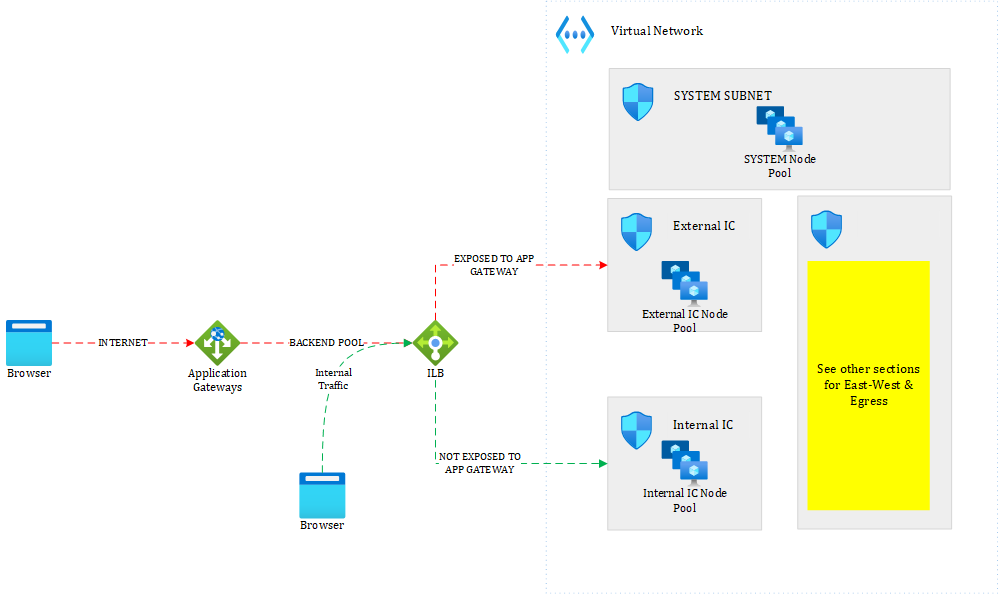

# The different ways to manage ingress traffic in AKS
Ingress traffic in AKS is not an easy topic because there are many different ways to handle it. Another reason why ingress is rather tricky is because K8s itself is transitioning from the *Ingress API* to the *Gateway API* but as of 04/2024, the Gateway API is still not fully adopted and mature, which puts us in an in-between situation.

Nevertheless, some of the architectural concepts depicted in this page apply, whether we use K8s'Ingress API or the Gateway one.

# Two types of LoadBalancer Services

When deploying a K8s *LoadBalancer Service* into AKS, you have two options:

- Deploying the service with an External IP address
- Deploying the service with an Internal IP address

By default, an external IP address is used. Note that most enterprises do not do that even for Internet facing workloads because they typically have another Internet Ingress endpoint such as a WAF (Web Application Firewall) that is filtering any incoming Internet traffic. So, to meeting Enterprise-grade security requirements, you will only work with the second option. 

To mark a Load Balancer internal, you must use the following annotations:

```serviceAnnotations:
  service.beta.kubernetes.io/azure-load-balancer-internal: "true"
  service.beta.kubernetes.io/azure-load-balancer-internal-subnet: <subnet>
```

where <subnet> lets you choose the target subnet in which you want the particular IP to be deployed. 

# Ingress controllers 

I already shed some light on the different options in the [Cluster Ingress section of the AKS Cheat Sheet](https://github.com/stephaneey/azure-and-k8s-architecture/blob/main/cheat%20sheets/aks.md). I will depict below a possible approach using Istio Ingress. Note that the overall principles should work just as fine with other ingress controllers such as NGINX, etc.

# Ingress topologies - Istio as an example
There are many moving parts (as always), but there are three ways to deploy Istion ingress controllers:
- Using the IstioOperator but this one seems to be on the deprecation path although no clear communication has been made as of 03/2024
- Using Helm  
- Using IstioCtl

I'll let you check your prefered option [here](https://istio.io/latest/docs/setup/install/operator/).

## One ingress controller for everything


In the above topology, you share a single ingress controller for whatever type of traffic you are dealing with. Yet, I would encourage you to use a dedicated subnet and node pool to clearly segregate the ingress function from the rest of the cluster. Here are the pros & cons of such an approach.

**Pros**
- Compute friendly because there is no overhead
**Cons**
- Can be challenging to delegate work to application teams since they will all target the same gateway overall.
- No clear path between internet facing and internal facing applications
- Single point of failure

If you adopt such a topology, make sure to increase the number of replicas and use availability zones to spread the pod instances across nodes sitting in different zones.

## One ingress controller for internal traffic and one for external traffic
With AKS, we can enable the *Azure Mesh*, which leverages Istio behind the scenes and one of the supported topology is to enable two ingress channels, one for internal-only traffic and one for external traffic. However, the external ingress controller is associated with a public IP attached to the default external load balancer, which is not ideal as we typically prefer to have everything private and consolidate public endpoints through Web Application Firewalls or firewalls should you deal with non-HTTP traffic. 

## One ingress controller per domain
## One ingress controller per application

